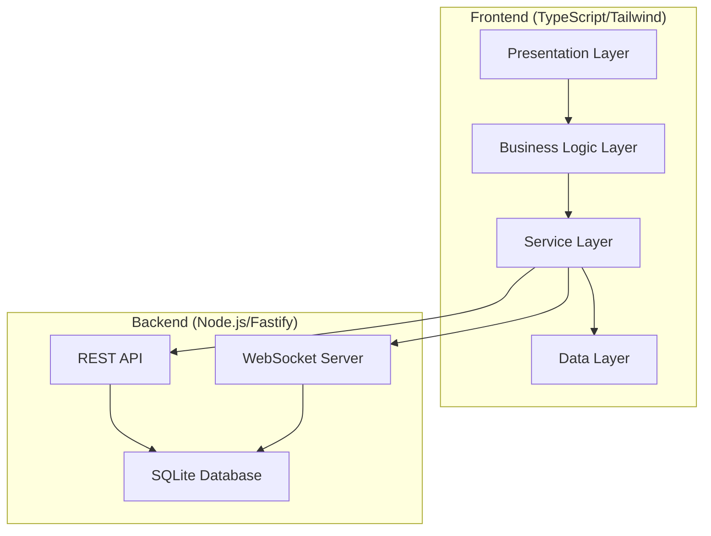

# ft_transcendence

This project is the final web project for 42Seoul, a modern web application that provides a real-time multiplayer Pong game and tournament system. It combines a terminal-style CLI interface with modern web technologies to offer a unique and engaging user experience.

## Quick Start

### Running the full environment with Docker
```bash
make all
```

### Running in Development Mode
```bash
# Check environment status
make status

# View development guide
make dev-guide
```

## Key Features

-   **User Authentication**: Supports local login, Google OAuth, and 2FA.
-   **Friend System**: Add/remove friends, check online status.
-   **Real-time Games**: Classic Pong game with real-time matchmaking.
-   **Tournaments**: Bracket-style tournament system.
-   **Terminal Interface**: A unique CLI-style interface for all interactions.
-   **Internationalization (i18n)**: Support for Korean, English, and Japanese, switchable via a terminal command (`lang <ko|en|ja>`).

## Tech Stack

-   **Frontend**: TypeScript, Vanilla JavaScript, TailwindCSS, HTML5 Canvas
-   **Backend**: Node.js, Fastify, TypeScript
-   **Real-time Communication**: WebSocket
-   **Database**: SQLite
-   **Internationalization**: i18next
-   **Deployment**: Docker

## Architecture

The frontend follows a layered architecture to ensure a clear separation of concerns and scalability.

```
┌─────────────────────────────────────────────────────────────┐
│                    Presentation Layer                       │
│   (App.ts, Terminal.ts, GamePage.ts, UserProfile.ts)        │
└─────────────────────────────────────────────────────────────┘
                              │
┌─────────────────────────────────────────────────────────────┐
│                   Business Logic Layer                     │
│   (AuthManager, UIRenderer, ModalManager, GameManager)      │
└─────────────────────────────────────────────────────────────┘
                              │
┌─────────────────────────────────────────────────────────────┐
│                     Service Layer                          │
│   (ApiClient, WebSocketService, i18n, Router, GameClient)  │
└─────────────────────────────────────────────────────────────┘
                              │
┌─────────────────────────────────────────────────────────────┐
│                      Data Layer                            │
│   (authStore, userProfileStore)                             │
└─────────────────────────────────────────────────────────────┘
```

### System Architecture Overview



### Core Architectural Principles

1.  **Layered Structure**: Presentation → Business Logic → Service → Data.
2.  **Dependency Injection**: Explicit dependency management via constructors.
3.  **Centralized State**: Store-based state management (Redux-like pattern).
4.  **Event-Driven Communication**: Observer pattern and callback system.
5.  **Modularity**: Independent modules for each feature.
6.  **Type Safety**: Strong type system based on TypeScript.

### Core Components & Services

-   **`App.ts`**: The main application controller that manages the application lifecycle, dependency injection, and routing.
-   **`Terminal.ts`**: A CLI-style user interface for command input, output display, and history management.
-   **`GamePage.ts`**: Manages the game screen, including rendering, real-time state synchronization, and input handling.
-   **`AuthManager.ts`**: Handles all authentication logic, including login/logout flows, 2FA, and token management.
-   **`ApiClient.ts`**: A factory for all API services, managing HTTP communication with the backend REST API.
-   **`WebSocketService.ts`**: Manages real-time, event-based communication with the backend WebSocket server for gameplay and notifications.
-   **`authStore` / `userProfileStore`**: Centralized stores for managing authentication and user profile state using a custom Redux-like pattern.
