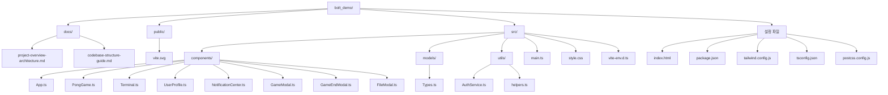
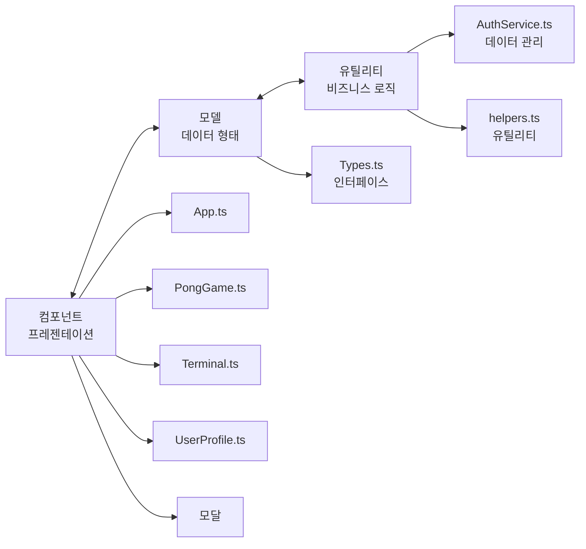
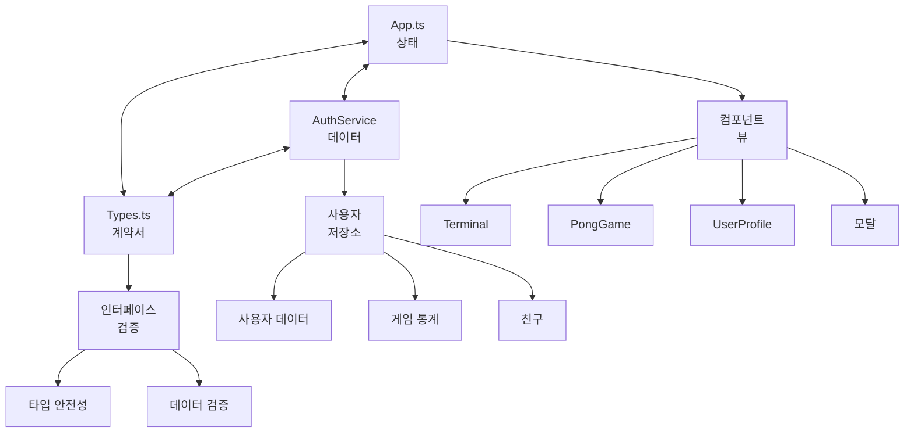
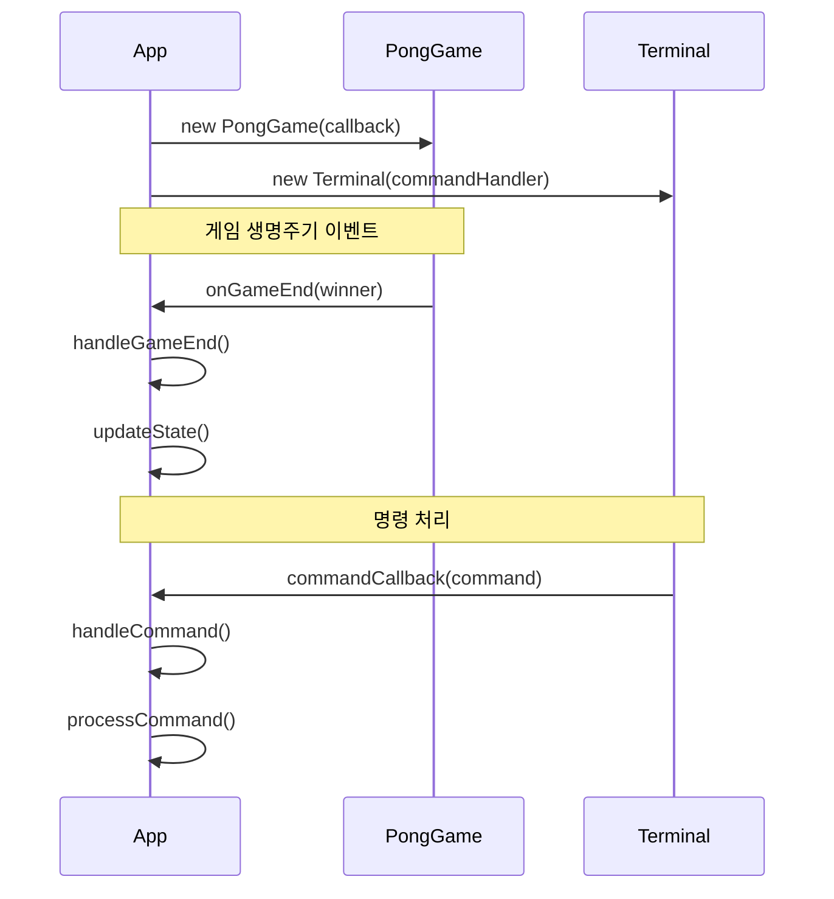
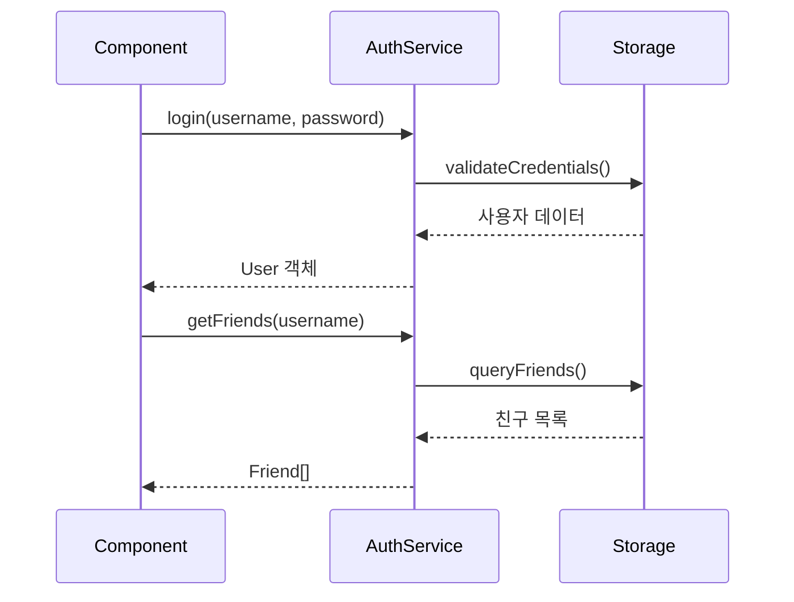
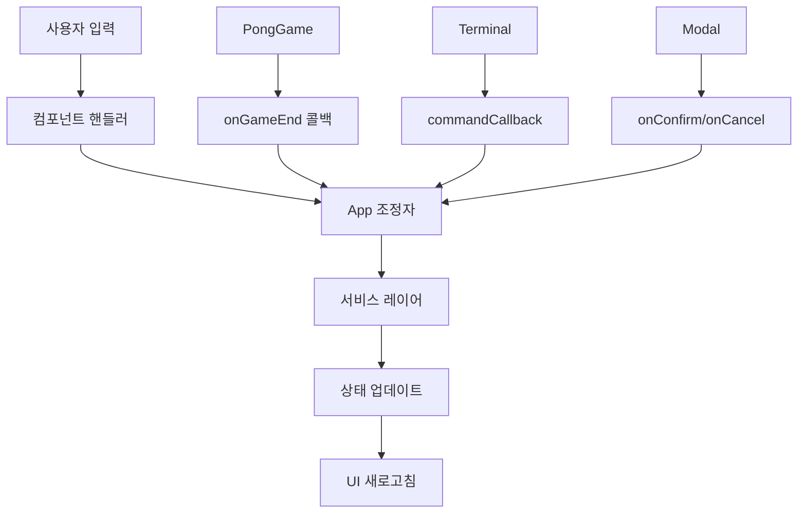
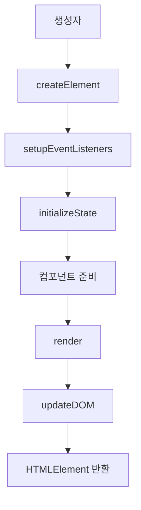
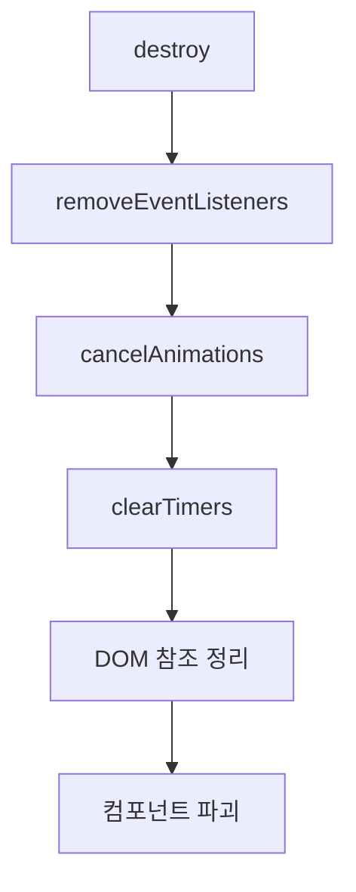
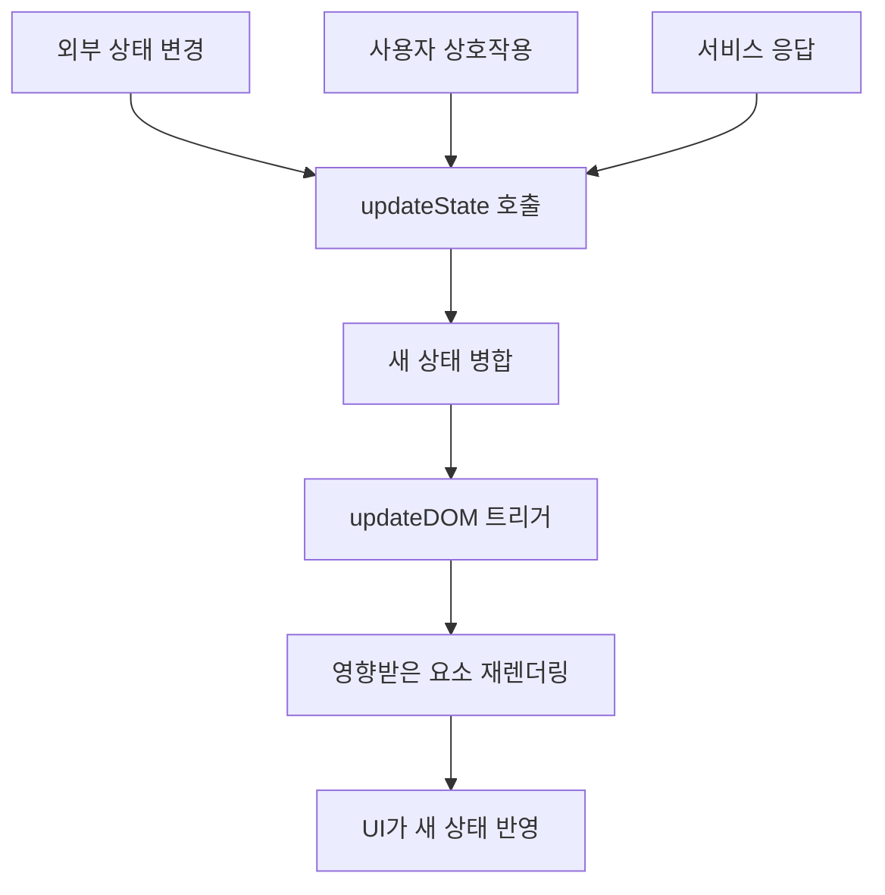

# PONG-CLI - 코드베이스 구조 가이드

## 📁 디렉토리 구조 개요

```
bolt_demo/
├── docs/                          # 문서 파일
│   ├── project-overview-architecture.md
│   └── codebase-structure-guide.md
├── public/                        # 정적 자산
│   └── vite.svg                   # Vite 로고 자산
├── src/                           # 소스 코드
│   ├── components/                # UI 컴포넌트
│   │   ├── App.ts                 # 메인 애플리케이션 오케스트레이터
│   │   ├── PongGame.ts            # 게임 엔진 및 렌더링
│   │   ├── Terminal.ts            # 터미널 인터페이스 시뮬레이션
│   │   ├── UserProfile.ts         # 사용자 프로필 관리
│   │   ├── NotificationCenter.ts  # 알림 시스템
│   │   ├── GameModal.ts           # 게임 설정 및 토너먼트 모달
│   │   ├── GameEndModal.ts        # 게임 종료 후 결과 모달
│   │   └── FileModal.ts           # 파일 시스템 시뮬레이션 모달
│   ├── models/                    # 데이터 모델 및 인터페이스
│   │   └── Types.ts               # TypeScript 인터페이스 및 타입
│   ├── utils/                     # 유틸리티 함수 및 서비스
│   │   ├── AuthService.ts         # 인증 및 사용자 관리
│   │   └── helpers.ts             # 공통 유틸리티 함수
│   ├── main.ts                    # 애플리케이션 진입점
│   ├── style.css                  # 전역 스타일 및 TailwindCSS
│   ├── typescript.svg             # TypeScript 로고 자산
│   └── vite-env.d.ts             # Vite 환경 타입 정의
├── index.html                     # HTML 진입점
├── package.json                   # 프로젝트 의존성 및 스크립트
├── package-lock.json              # 잠긴 의존성 버전
├── tailwind.config.js             # TailwindCSS 구성
├── tsconfig.json                  # TypeScript 구성
└── postcss.config.js              # PostCSS 구성
```

### 시각적 디렉토리 구조



## 🗂️ 파일 구성 원칙

### 1. **기능 기반 컴포넌트 구성**
컴포넌트는 파일 타입이 아닌 기능별로 구성됩니다:
- **핵심 컴포넌트**: App, PongGame, Terminal, UserProfile
- **모달 컴포넌트**: GameModal, GameEndModal, FileModal
- **시스템 컴포넌트**: NotificationCenter

### 2. **관심사의 분리**
```
┌─────────────────┐    ┌─────────────────┐    ┌─────────────────┐
│   컴포넌트      │    │     모델        │    │   유틸리티      │
│  (프레젠테이션) │ ←→ │  (데이터 형태)  │ ←→ │   (비즈니스)    │
└─────────────────┘    └─────────────────┘    └─────────────────┘
```



### 3. **구성 통합**
모든 빌드 및 스타일링 구성은 쉬운 접근과 수정을 위해 루트 레벨에 보관됩니다.

## 컴포넌트 아키텍처 심화 분석

### 핵심 애플리케이션 컴포넌트

#### **App.ts** - 메인 애플리케이션 오케스트레이터
```typescript
// 주요 책임:
- 애플리케이션 상태 관리 (AppState)
- 컴포넌트 생명주기 조정
- 뷰 간 라우트 처리
- 터미널 세션의 탭 관리
- 명령 처리 및 위임
```

**내부 구조:**
- **상태 관리**: 중앙화된 `AppState` 객체
- **컴포넌트 인스턴스**: Terminal, PongGame, UserProfile 인스턴스 관리
- **이벤트 조정**: 컴포넌트 간 통신 처리
- **DOM 관리**: 메인 콘텐츠 영역 렌더링 제어

#### **PongGame.ts** - 게임 엔진
```typescript
// 주요 책임:
- 게임 물리 계산
- 공 움직임 및 충돌 감지
- 패들 제어 (플레이어 입력 + AI)
- 게임 모드 관리 (데모/일반/토너먼트)
- 점수 및 라운드 추적
```

**내부 구조:**
- **게임 상태**: 공 위치, 패들 위치, 점수
- **애니메이션 루프**: RequestAnimationFrame 기반 게임 루프
- **입력 처리**: 키보드 이벤트 관리
- **렌더링**: DOM 기반 게임 요소 위치 지정

#### **Terminal.ts** - CLI 인터페이스 시뮬레이션
```typescript
// 주요 책임:
- 명령 입력 처리
- 터미널 스타일로 출력 렌더링
- 명령 기록 관리
- 채팅 모드 기능
- 터미널 미학 (스크롤링, 포맷팅)
```

**내부 구조:**
- **DOM 요소**: 입력 필드, 출력 컨테이너, 프롬프트
- **기록 관리**: 화살표 키 탐색이 있는 명령 기록
- **출력 포맷팅**: 타임스탬프 포맷팅, 메시지 스타일링
- **모드 전환**: 메인 터미널 vs 채팅 모드

#### **UserProfile.ts** - 사용자 관리 인터페이스
```typescript
// 주요 책임:
- 사용자 정보 표시
- 통계 렌더링 (게임, 업적)
- 친구 목록 관리
- 프로필 편집 기능
```

### 모달 컴포넌트

#### **GameModal.ts** - 게임 설정 인터페이스
- 토너먼트 브래킷 표시
- 게임 모드 선택
- 친구 초대 시스템
- 멀티플레이어 게임 조정

#### **GameEndModal.ts** - 게임 후 인터페이스
- 게임 결과 표시
- 토너먼트 진행
- 재경기 기능
- 통계 업데이트

#### **FileModal.ts** - 파일 시스템 시뮬레이션
- 프로필 파일 관리
- 가져오기/내보내기 기능
- 파일 브라우저 미학

### 시스템 컴포넌트

#### **NotificationCenter.ts** - 알림 관리
- 실시간 알림 표시
- 메시지 큐잉 및 전달
- 사용자 상호작용 처리
- 알림 지속성

## 📊 데이터 흐름 아키텍처

### 상태 관리 흐름
```
┌─────────────┐    ┌─────────────┐    ┌─────────────┐
│    App.ts   │ ←→ │ AuthService │ ←→ │   Types.ts  │
│   (상태)     │    │   (데이터)    │    │ (계약서)     │
└─────────────┘    └─────────────┘    └─────────────┘
       ↓                  ↓                  ↓
┌─────────────┐    ┌─────────────┐    ┌─────────────┐
│ 컴포넌트      │    │   사용자      │    │ 인터페이스     │
│  (뷰)        │    │ (저장소)     │    │ (검증)       │
└─────────────┘    └─────────────┘    └─────────────┘
```



### 컴포넌트 통신 패턴

#### **1. 부모-자식 통신**
```typescript
// App.ts → PongGame.ts
this.pongGame = new PongGame((winner) => {
  this.handleGameEnd(winner);
});

// App.ts → Terminal.ts
this.terminal = new Terminal(this.handleCommand.bind(this));
```



#### **2. 서비스 레이어 통신**
```typescript
// 모든 컴포넌트 → AuthService
this.authService.login(username, password);
this.authService.getFriends(username);
```



#### **3. 이벤트 기반 통신**
```typescript
// PongGame → App (콜백을 통해)
onGameEnd?.('left' | 'right');

// Terminal → App (콜백을 통해)
commandCallback(command: string);
```



## 🛠️ 유틸리티 레이어 구조

### **AuthService.ts** - 데이터 관리
```typescript
class AuthService {
  // 메모리 내 사용자 저장소
  private users: Record<string, User> = {};
  
  // 인증 메서드
  public login(username: string, password?: string): User
  public register(email: string, password: string, nickname: string): User
  
  // 소셜 기능
  public getFriends(username: string): Friend[]
  public addFriend(username: string, friendUsername: string): void
}
```

### **helpers.ts** - 공통 유틸리티
```typescript
// 채팅 및 타임스탬프를 위한 시간 포맷팅
export const formatTime = (): string

// 등록을 위한 이메일 검증
export const validateEmail = (email: string): boolean

// 부드러운 스크롤 유틸리티
export const scrollToBottom = (element: HTMLElement): void
```

## 🎨 스타일링 아키텍처

### **TailwindCSS 구성** (`tailwind.config.js`)
```javascript
// 사용자 정의 터미널 색상 팔레트
colors: {
  terminal: {
    black: '#0D0D0D',      // 배경
    green: '#3EFF3E',      // 기본 텍스트
    darkGreen: '#28A428',  // 보조 요소
    red: '#FF5F56',        // 오류 상태
    yellow: '#FFBD2E',     // 경고 상태
    gray: '#444444'        // 비활성화/미묘한 요소
  }
}

// 터미널 특정 애니메이션
animations: {
  'blink': '커서 깜빡임 효과',
  'typing': '타자기 효과',
  'slide-in/out': '모달 애니메이션'
}
```

### **전역 스타일** (`src/style.css`)
```css
/* TailwindCSS 가져오기 */
@tailwind base;
@tailwind components;
@tailwind utilities;

/* 터미널 테마를 위한 사용자 정의 CSS 변수 */
:root {
  --terminal-green: #3EFF3E;
  --terminal-black: #0D0D0D;
}

/* 터미널 미학을 위한 유틸리티 클래스 */
.scrollbar-hide { /* 기능을 유지하면서 스크롤바 숨기기 */ }
```

## 🔧 구성 파일

### **TypeScript 구성** (`tsconfig.json`)
```json
{
  "compilerOptions": {
    "target": "ES2020",           // 현대적인 JavaScript 기능
    "module": "ESNext",           // ES 모듈
    "moduleResolution": "bundler", // Vite 호환 해결
    "strict": true,               // 엄격한 타입 검사
    "skipLibCheck": true          // 외부 라이브러리 검사 건너뛰기
  }
}
```

### **Vite 구성** (암시적)
- **개발 서버**: 핫 모듈 교체
- **빌드 프로세스**: TypeScript 컴파일 + 번들링
- **자산 처리**: 정적 파일 처리

## 📦 의존성 관리

### **핵심 의존성** (`package.json`)
```json
{
  "devDependencies": {
    "typescript": "^5.5.3",      // 타입 검사 및 컴파일
    "vite": "^5.4.2",            // 빌드 도구 및 개발 서버
    "tailwindcss": "^3.3.5",     // CSS 프레임워크
    "autoprefixer": "^10.4.16",  // CSS 벤더 접두사
    "postcss": "^8.4.31"         // CSS 처리 파이프라인
  }
}
```

### **런타임 의존성 없음**
- 순수 TypeScript/JavaScript 구현
- 프레임워크 의존성 없음 (React, Vue 등)
- 최소 번들 크기 및 빠른 시작

## 🔄 컴포넌트 생명주기 패턴

### **초기화 패턴**
```typescript
// 컴포넌트 생성자
constructor() {
  this.createElement();
  this.setupEventListeners();
  this.initializeState();
}

// 컴포넌트 렌더링
public render(): HTMLElement {
  this.updateDOM();
  return this.element;
}
```



### **정리 패턴**
```typescript
// 이벤트 리스너 정리
public destroy(): void {
  this.removeEventListeners();
  this.cancelAnimations();
  this.clearTimers();
}
```



### **상태 업데이트 패턴**
```typescript
// 반응적 상태 업데이트
private updateState(newState: Partial<State>): void {
  this.state = { ...this.state, ...newState };
  this.updateDOM();
}
```



## 🎯 파일 명명 규칙

### **컴포넌트 파일**
- **형식**: `PascalCase.ts` (예: `UserProfile.ts`)
- **패턴**: 설명적이고 명사 기반 이름
- **위치**: `src/components/`

### **유틸리티 파일**
- **형식**: `camelCase.ts` (예: `helpers.ts`)
- **패턴**: 기능 또는 목적 기반 이름
- **위치**: `src/utils/`

### **타입 정의 파일**
- **형식**: `PascalCase.ts` (예: `Types.ts`)
- **패턴**: 콘텐츠 타입을 설명하는 이름
- **위치**: `src/models/`

### **구성 파일**
- **형식**: 표준 이름 (예: `tailwind.config.js`)
- **패턴**: 도구별 명명 규칙
- **위치**: 프로젝트 루트

## 🔍 가져오기/내보내기 패턴

### **컴포넌트 내보내기**
```typescript
// 단일 클래스 내보내기
export class Terminal { /* ... */ }

// 사용법
import { Terminal } from './components/Terminal';
```

### **타입 내보내기**
```typescript
// 다중 인터페이스 내보내기
export interface User { /* ... */ }
export interface Friend { /* ... */ }

// 사용법
import { User, Friend } from '../models/Types';
```

### **유틸리티 내보내기**
```typescript
// 명명된 함수 내보내기
export const formatTime = (): string => { /* ... */ };
export const validateEmail = (email: string): boolean => { /* ... */ };

// 사용법
import { formatTime, validateEmail } from '../utils/helpers';
```

## 🚀 개발 워크플로 통합

### **파일 변경 영향**
- **컴포넌트 변경**: UI 및 상호작용에 영향
- **타입 변경**: 컴포넌트 업데이트가 필요할 수 있음
- **유틸리티 변경**: 여러 컴포넌트에 영향을 줄 수 있음
- **구성 변경**: 빌드 프로세스 또는 스타일링에 영향

### **핫 모듈 교체**
- **컴포넌트**: 상태 보존과 함께 라이브 리로드
- **스타일**: 즉각적인 CSS 업데이트
- **타입**: 안전성을 위해 페이지 새로고침 필요

---

이 구조 가이드는 코드베이스의 포괄적인 지도를 제공하여 특정 기능을 쉽게 찾고, 컴포넌트 관계를 이해하며, 새로운 기능을 추가할 때 일관된 패턴을 유지할 수 있도록 합니다. 