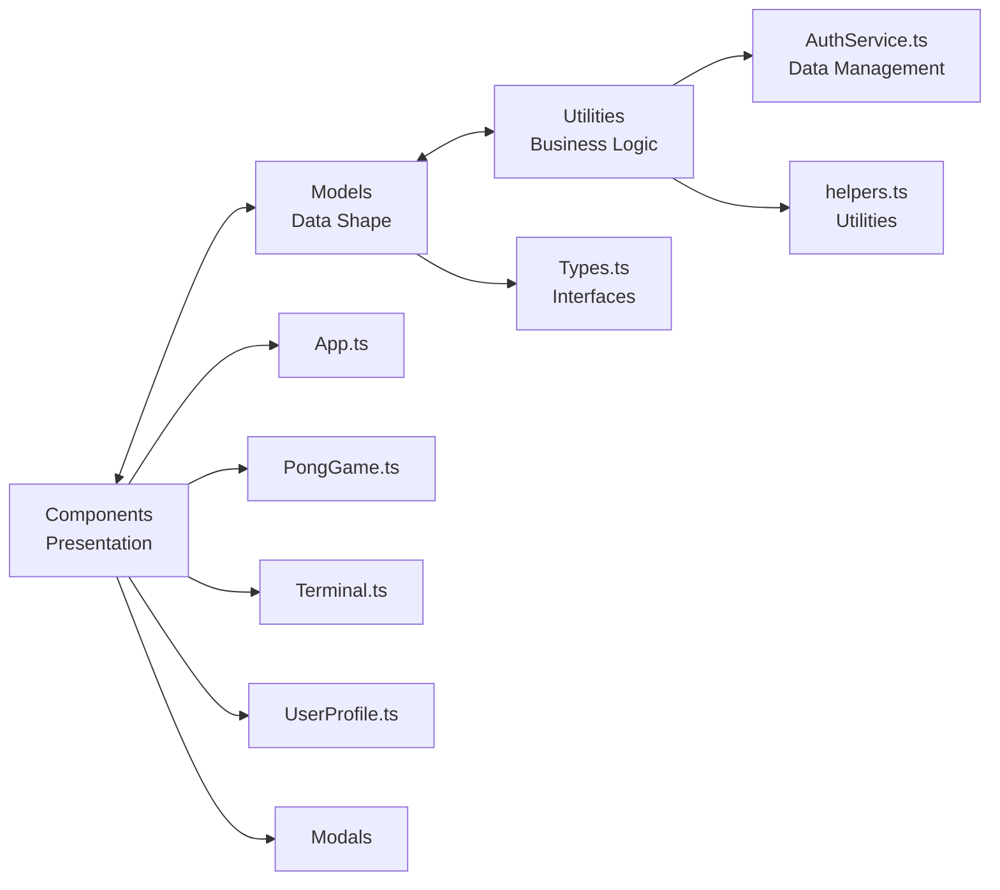
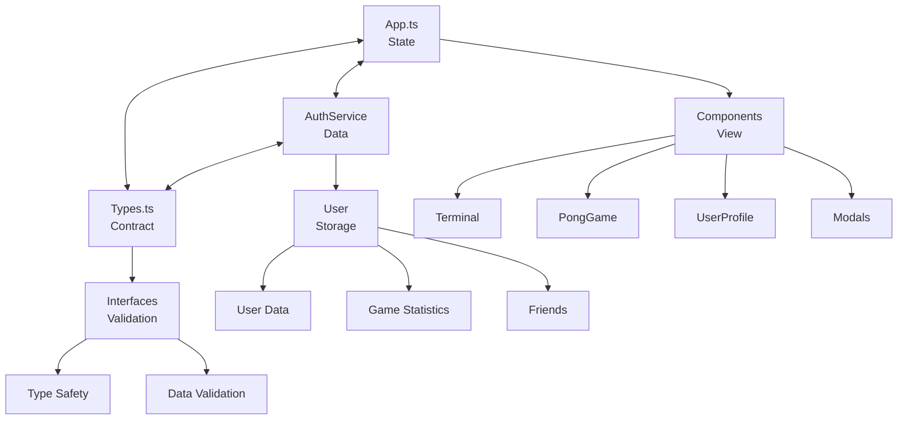
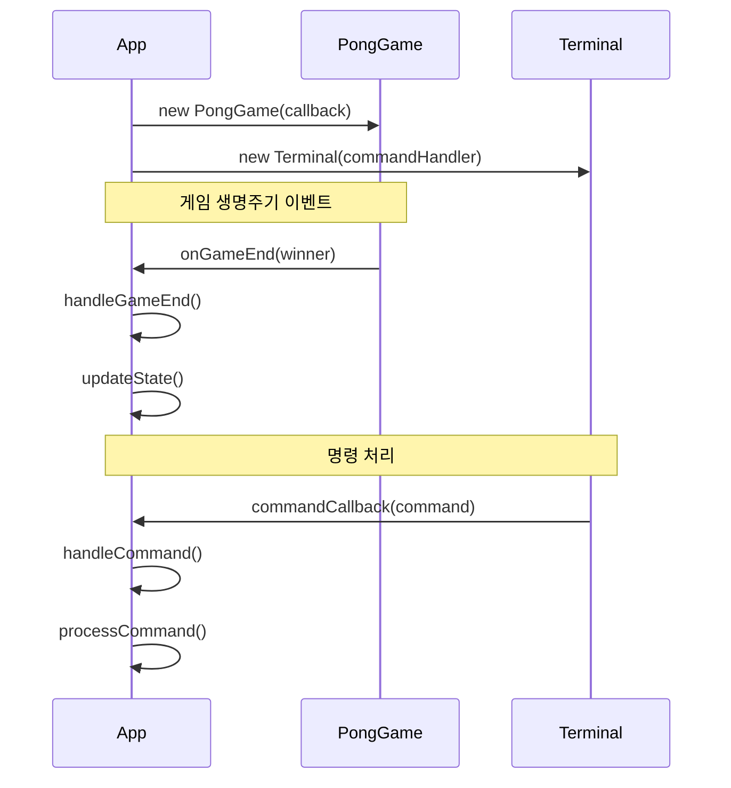
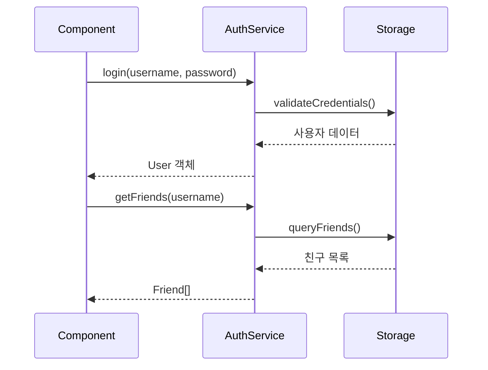
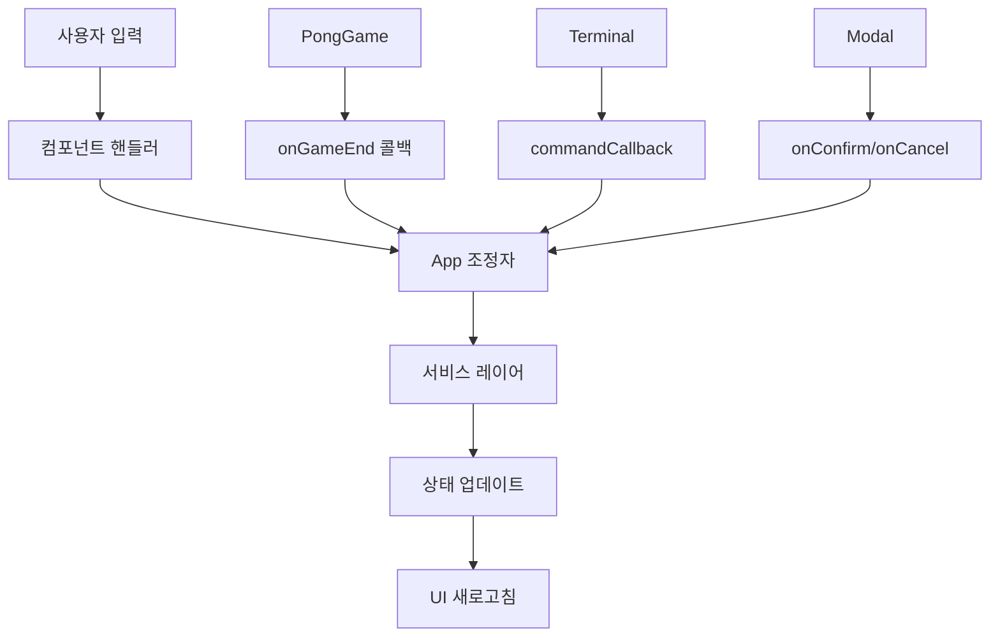
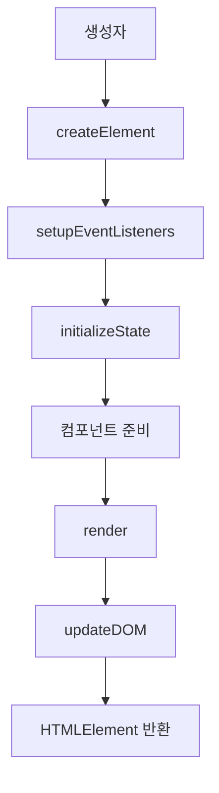
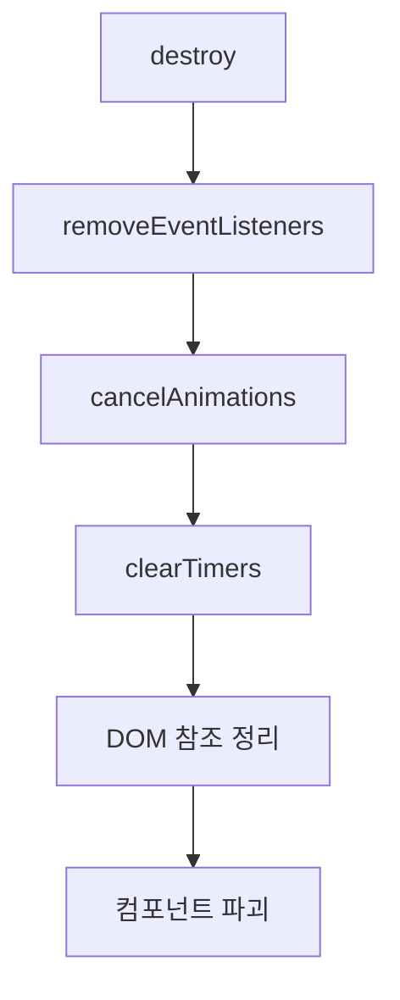
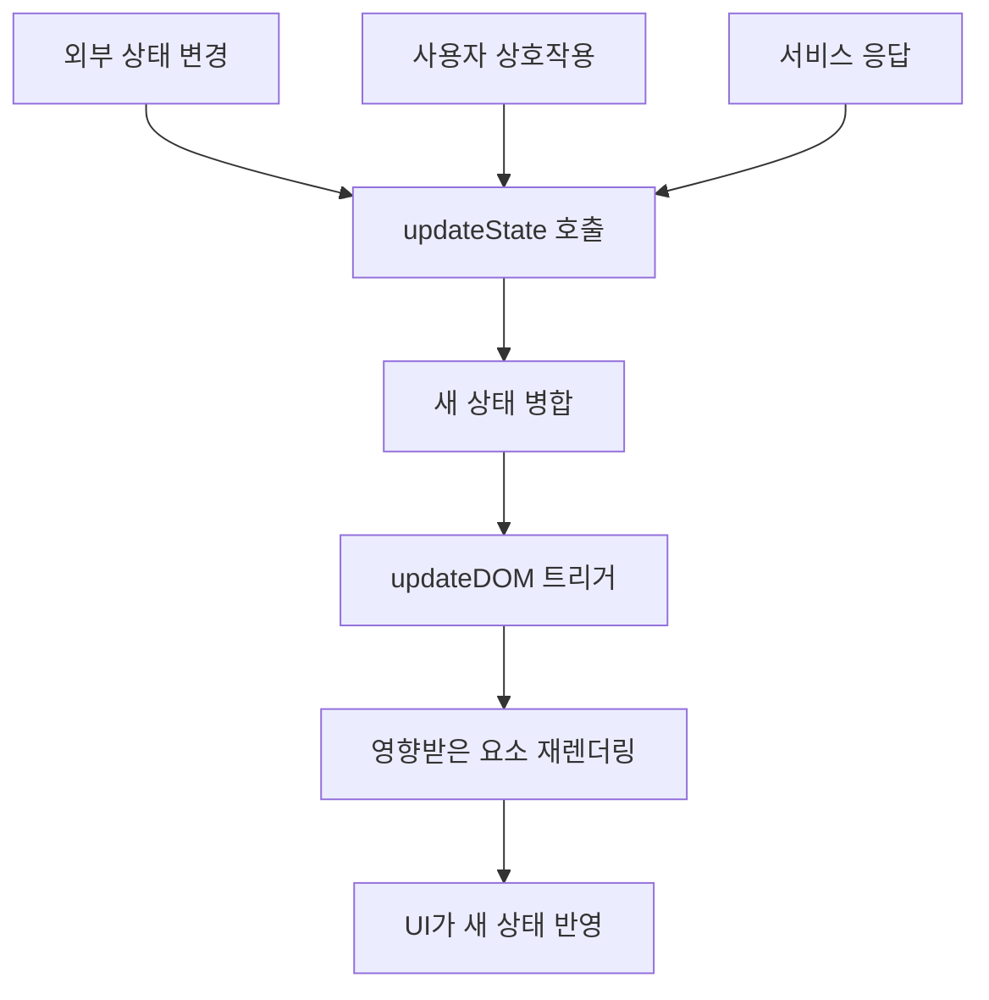

# ft_transcendence Frontend - Codebase Structure Guide

## 📁 Directory Structure Overview

```
ft_transcendence/frontend/
├── dist/                          # Build artifacts
├── node_modules/                  # NPM dependencies
├── public/                        # Static assets
│   ├── locales/                   # Multi-language resources
│   │   ├── en/translation.json    # English
│   │   ├── ja/translation.json    # Japanese
│   │   └── ko/translation.json    # Korean
│   ├── game-test.html             # Game test page
│   └── pingpong.svg               # App icon
├── src/                           # Source code
│   ├── main.ts                    # Application entry point
│   ├── style.css                  # Global styles (TailwindCSS)
│   ├── components/                # UI components
│   │   ├── App.ts                 # Main application controller
│   │   ├── Terminal.ts            # CLI-style terminal interface
│   │   ├── UserProfile.ts         # User profile display
│   │   ├── NotificationCenter.ts  # Centralized notification system
│   │   └── modals/                # Modal components
│   │       ├── index.ts           # Modal entry point
│   │       ├── LoginModal.ts      # Login modal
│   │       ├── RegisterModal.ts   # Registration modal
│   │       ├── TwoFAModal.ts      # 2FA authentication modal
│   │       ├── GameSetupModal.ts  # Game setup modal
│   │       ├── GameEndModal.ts    # Game end modal
│   │       └── FileModal.ts       # File system simulation
│   ├── managers/                  # Business logic managers
│   │   ├── index.ts               # Manager entry point
│   │   ├── AuthManager.ts         # Authentication management
│   │   ├── ModalManager.ts        # Modal state management (singleton)
│   │   ├── UIRenderer.ts          # UI rendering management
│   │   └── UserProfileManager.ts  # User profile management
│   ├── services/                  # Service layer
│   │   ├── index.ts               # Service entry point
│   │   ├── ApiClient.ts           # API client factory
│   │   ├── UserStateCache.ts      # User state caching
│   │   ├── i18n.ts                # Internationalization service
│   │   ├── api/                   # API services
│   │   │   ├── BaseApiService.ts  # Base API service class
│   │   │   ├── AuthApiService.ts  # Authentication API
│   │   │   ├── UserApiService.ts  # User API
│   │   │   ├── FriendApiService.ts # Friend management API
│   │   │   ├── GameApiService.ts  # Game API
│   │   │   └── TournamentApiService.ts # Tournament API
│   │   ├── core/                  # Core services
│   │   │   ├── TokenManager.ts    # JWT token management
│   │   │   ├── Interceptors.ts    # HTTP interceptors
│   │   │   └── DataTransformers.ts # Data transformation
│   │   ├── websocket/             # WebSocket services
│   │   │   └── WebSocketService.ts # Real-time communication
│   │   ├── mocks/                 # Mock services for development
│   │   │   ├── index.ts           # Mock service entry point
│   │   │   ├── AuthApiServiceMock.ts
│   │   │   ├── GameApiServiceMock.ts
│   │   │   ├── FriendApiServiceMock.ts
│   │   │   ├── UserApiServiceMock.ts
│   │   │   └── MockInterceptor.ts
│   │   └── utils/
│   │       └── TypeSafetyUtils.ts # Type safety utilities
│   ├── store/                     # State management
│   │   ├── index.ts               # Store entry point
│   │   ├── authStore.ts           # Authentication state store
│   │   └── userProfileStore.ts    # User profile state
│   ├── game/                      # Game system
│   │   ├── GameClient.ts          # Game client
│   │   ├── GamePage.ts            # Game page component
│   │   ├── GameRenderer.ts        # Canvas-based game rendering
│   │   ├── InputHandler.ts        # Input handling (keyboard/mouse)
│   │   ├── TournamentClient.ts    # Tournament client
│   │   ├── TournamentRenderer.ts  # Tournament rendering
│   │   └── TournamentErrorHandler.ts # Tournament error handling
│   ├── commands/                  # Terminal command system
│   │   └── CommandHandler.ts      # CLI command processing
│   ├── utils/                     # Utility functions
│   │   ├── index.ts               # Utility entry point
│   │   ├── Router.ts              # Client router
│   │   ├── DOMUpdater.ts          # DOM update utilities
│   │   ├── ErrorHandler.ts        # Global error handling (singleton)
│   │   ├── Logger.ts              # Structured logging
│   │   ├── UIUtils.ts             # UI-related utilities
│   │   └── validators.ts          # Input validation
│   ├── types/                     # TypeScript type definitions
│   │   ├── types.ts               # Common data types
│   │   ├── game-websocket.ts      # Game WebSocket types
│   │   └── tournament-websocket.ts # Tournament WebSocket types
│   └── config/                    # Configuration
│       └── environment.ts         # Environment settings
├── index.html                     # HTML entry point
├── package.json                   # Project dependencies and scripts
├── package-lock.json              # Locked dependency versions
├── tailwind.config.js             # TailwindCSS configuration
├── tsconfig.json                  # TypeScript configuration
├── postcss.config.js              # PostCSS configuration
├── Dockerfile                     # Docker container setup
└── nginx.conf                     # Nginx configuration
```

### Visual Directory Structure

```mermaid
graph TD
    A[ft_transcendence/frontend/] --> B[public/]
    A --> C[src/]
    A --> D[Configuration Files]
    
    B --> B1[locales/]
    B --> B2[game-test.html]
    B --> B3[pingpong.svg]
    B1 --> B1A[ko/translation.json]
    B1 --> B1B[en/translation.json]
    B1 --> B1C[ja/translation.json]
    
    C --> C1[components/]
    C --> C2[managers/]
    C --> C3[services/]
    C --> C4[store/]
    C --> C5[game/]
    C --> C6[utils/]
    C --> C7[types/]
    C --> C8[main.ts]
    
    C1 --> C1A[App.ts]
    C1 --> C1B[Terminal.ts]
    C1 --> C1C[UserProfile.ts]
    C1 --> C1D[modals/]
    C1D --> C1D1[LoginModal.ts]
    C1D --> C1D2[GameSetupModal.ts]
    
    C2 --> C2A[AuthManager.ts]
    C2 --> C2B[ModalManager.ts]
    C2 --> C2C[UIRenderer.ts]
    
    C3 --> C3A[api/]
    C3 --> C3B[websocket/]
    C3 --> C3C[mocks/]
    C3A --> C3A1[BaseApiService.ts]
    C3B --> C3B1[WebSocketService.ts]
    
    C4 --> C4A[authStore.ts]
    C4 --> C4B[userProfileStore.ts]
    
    C5 --> C5A[GameClient.ts]
    C5 --> C5B[GameRenderer.ts]
    C5 --> C5C[TournamentClient.ts]
    
    D --> D1[index.html]
    D --> D2[package.json]
    D --> D3[tailwind.config.js]
    D --> D4[tsconfig.json]
    D --> D5[Dockerfile]
```



## 🗂️ File Organization Principles

### 1. **Feature-based Component Organization**
Components are organized by functionality rather than file type:
- **Core Components**: App, PongGame, Terminal, UserProfile
- **Modal Components**: GameModal, GameEndModal, FileModal
- **System Components**: NotificationCenter

### 2. **Separation of Concerns**
```
┌─────────────────┐    ┌─────────────────┐    ┌─────────────────┐
│   Components    │    │     Models      │    │   Utilities     │
│ (Presentation)  │ ←→ │  (Data Shape)   │ ←→ │   (Business)    │
└─────────────────┘    └─────────────────┘    └─────────────────┘
```



### 3. **Configuration Consolidation**
All build and styling configurations are kept at root level for easy access and modification.

## Component Architecture Deep Dive

### Core Application Components

#### **App.ts** - Main Application Orchestrator
```typescript
// Key responsibilities:
- Application state management (AppState)
- Component lifecycle coordination
- Route handling between views
- Tab management for terminal sessions
- Command processing and delegation
```

**Internal Structure:**
- **State Management**: Centralized `AppState` object
- **Component Instances**: Managing Terminal, PongGame, UserProfile instances
- **Event Coordination**: Handling inter-component communication
- **DOM Management**: Controlling main content area rendering

#### **PongGame.ts** - Game Engine
```typescript
// Key responsibilities:
- Game physics calculations
- Ball movement and collision detection
- Paddle control (player input + AI)
- Game mode management (demo/normal/tournament)
- Score and round tracking
```

**Internal Structure:**
- **Game State**: Ball position, paddle positions, scores
- **Animation Loop**: RequestAnimationFrame-based game loop
- **Input Processing**: Keyboard event management
- **Rendering**: DOM-based game element positioning

#### **Terminal.ts** - CLI Interface Simulation
```typescript
// Key responsibilities:
- Command input processing
- Terminal-style output rendering
- Command history management
- Chat mode functionality
- Terminal aesthetics (scrolling, formatting)
```

**Internal Structure:**
- **DOM Elements**: Input field, output container, prompt
- **History Management**: Command history with arrow key navigation
- **Output Formatting**: Timestamp formatting, message styling
- **Mode Switching**: Main terminal vs chat mode

#### **UserProfile.ts** - User Management Interface
```typescript
// Key responsibilities:
- User information display
- Statistics rendering (games, achievements)
- Friend list management
- Profile editing functionality
```

### Modal Components

#### **GameModal.ts** - Game Setup Interface
- Tournament bracket display
- Game mode selection
- Friend invitation system
- Multiplayer game coordination

#### **GameEndModal.ts** - Post-game Interface
- Game result display
- Tournament progression
- Rematch functionality
- Statistics update

#### **FileModal.ts** - File System Simulation
- Profile file management
- Import/export functionality
- File browser aesthetics

### System Components

#### **NotificationCenter.ts** - Notification Management
- Real-time notification display
- Message queuing and delivery
- User interaction handling
- Notification persistence

## 📊 Data Flow Architecture

### State Management Flow
```
┌─────────────┐    ┌─────────────┐    ┌─────────────┐
│    App.ts   │ ←→ │ AuthService │ ←→ │   Types.ts  │
│   (State)   │    │   (Data)    │    │ (Contract)  │
└─────────────┘    └─────────────┘    └─────────────┘
       ↓                  ↓                  ↓
┌─────────────┐    ┌─────────────┐    ┌─────────────┐
│ Components  │    │    User     │    │ Interfaces  │
│   (View)    │    │  (Storage)  │    │(Validation) │
└─────────────┘    └─────────────┘    └─────────────┘
```



### 컴포넌트 통신 패턴

#### **1. 부모-자식 통신**
```typescript
// App.ts → PongGame.ts
this.pongGame = new PongGame((winner) => {
  this.handleGameEnd(winner);
});

// App.ts → Terminal.ts
this.terminal = new Terminal(this.handleCommand.bind(this));
```



#### **2. 서비스 레이어 통신**
```typescript
// 모든 컴포넌트 → AuthService
this.authService.login(username, password);
this.authService.getFriends(username);
```



#### **3. 이벤트 기반 통신**
```typescript
// PongGame → App (콜백을 통해)
onGameEnd?.('left' | 'right');

// Terminal → App (콜백을 통해)
commandCallback(command: string);
```



## 🛠️ 유틸리티 레이어 구조

### **AuthService.ts** - 데이터 관리
```typescript
class AuthService {
  // 메모리 내 사용자 저장소
  private users: Record<string, User> = {};
  
  // 인증 메서드
  public login(username: string, password?: string): User
  public register(email: string, password: string, nickname: string): User
  
  // 소셜 기능
  public getFriends(username: string): Friend[]
  public addFriend(username: string, friendUsername: string): void
}
```

### **helpers.ts** - 공통 유틸리티
```typescript
// 채팅 및 타임스탬프를 위한 시간 포맷팅
export const formatTime = (): string

// 등록을 위한 이메일 검증
export const validateEmail = (email: string): boolean

// 부드러운 스크롤 유틸리티
export const scrollToBottom = (element: HTMLElement): void
```

## 🎨 스타일링 아키텍처

### **TailwindCSS 구성** (`tailwind.config.js`)
```javascript
// 사용자 정의 터미널 색상 팔레트
colors: {
  terminal: {
    black: '#0D0D0D',      // 배경
    green: '#3EFF3E',      // 기본 텍스트
    darkGreen: '#28A428',  // 보조 요소
    red: '#FF5F56',        // 오류 상태
    yellow: '#FFBD2E',     // 경고 상태
    gray: '#444444'        // 비활성화/미묘한 요소
  }
}

// 터미널 특정 애니메이션
animations: {
  'blink': '커서 깜빡임 효과',
  'typing': '타자기 효과',
  'slide-in/out': '모달 애니메이션'
}
```

### **전역 스타일** (`src/style.css`)
```css
/* TailwindCSS 가져오기 */
@tailwind base;
@tailwind components;
@tailwind utilities;

/* 터미널 테마를 위한 사용자 정의 CSS 변수 */
:root {
  --terminal-green: #3EFF3E;
  --terminal-black: #0D0D0D;
}

/* 터미널 미학을 위한 유틸리티 클래스 */
.scrollbar-hide { /* 기능을 유지하면서 스크롤바 숨기기 */ }
```

## 🔧 구성 파일

### **TypeScript 구성** (`tsconfig.json`)
```json
{
  "compilerOptions": {
    "target": "ES2020",           // 현대적인 JavaScript 기능
    "module": "ESNext",           // ES 모듈
    "moduleResolution": "bundler", // Vite 호환 해결
    "strict": true,               // 엄격한 타입 검사
    "skipLibCheck": true          // 외부 라이브러리 검사 건너뛰기
  }
}
```

### **Vite 구성** (암시적)
- **개발 서버**: 핫 모듈 교체
- **빌드 프로세스**: TypeScript 컴파일 + 번들링
- **자산 처리**: 정적 파일 처리

## 📦 의존성 관리

### **핵심 의존성** (`package.json`)
```json
{
  "devDependencies": {
    "typescript": "^5.5.3",      // 타입 검사 및 컴파일
    "vite": "^5.4.2",            // 빌드 도구 및 개발 서버
    "tailwindcss": "^3.3.5",     // CSS 프레임워크
    "autoprefixer": "^10.4.16",  // CSS 벤더 접두사
    "postcss": "^8.4.31"         // CSS 처리 파이프라인
  }
}
```

### **런타임 의존성 없음**
- 순수 TypeScript/JavaScript 구현
- 프레임워크 의존성 없음 (React, Vue 등)
- 최소 번들 크기 및 빠른 시작

## 🔄 컴포넌트 생명주기 패턴

### **초기화 패턴**
```typescript
// 컴포넌트 생성자
constructor() {
  this.createElement();
  this.setupEventListeners();
  this.initializeState();
}

// 컴포넌트 렌더링
public render(): HTMLElement {
  this.updateDOM();
  return this.element;
}
```



### **정리 패턴**
```typescript
// 이벤트 리스너 정리
public destroy(): void {
  this.removeEventListeners();
  this.cancelAnimations();
  this.clearTimers();
}
```



### **상태 업데이트 패턴**
```typescript
// 반응적 상태 업데이트
private updateState(newState: Partial<State>): void {
  this.state = { ...this.state, ...newState };
  this.updateDOM();
}
```



## 🎯 File Naming Conventions

### **Component Files**
- **Format**: `PascalCase.ts` (e.g., `UserProfile.ts`)
- **Pattern**: Descriptive, noun-based names
- **Location**: `src/components/`

### **Utility Files**
- **Format**: `camelCase.ts` (e.g., `helpers.ts`)
- **Pattern**: Function or purpose-based names
- **Location**: `src/utils/`

### **Type Definition Files**
- **Format**: `PascalCase.ts` (e.g., `Types.ts`)
- **Pattern**: Names describing content type
- **Location**: `src/models/`

### **Configuration Files**
- **Format**: Standard names (e.g., `tailwind.config.js`)
- **Pattern**: Tool-specific naming conventions
- **Location**: Project root

## 🔍 Import/Export Patterns

### **Component Exports**
```typescript
// Single class export
export class Terminal { /* ... */ }

// Usage
import { Terminal } from './components/Terminal';
```

### **Type Exports**
```typescript
// Multiple interface exports
export interface User { /* ... */ }
export interface Friend { /* ... */ }

// Usage
import { User, Friend } from '../models/Types';
```

### **Utility Exports**
```typescript
// Named function exports
export const formatTime = (): string => { /* ... */ };
export const validateEmail = (email: string): boolean => { /* ... */ };

// Usage
import { formatTime, validateEmail } from '../utils/helpers';
```

## 🚀 Development Workflow Integration

### **File Change Impact**
- **Component Changes**: Affects UI and interactions
- **Type Changes**: May require component updates
- **Utility Changes**: Can affect multiple components
- **Configuration Changes**: Affects build process or styling

### **Hot Module Replacement**
- **Components**: Live reload with state preservation
- **Styles**: Instant CSS updates
- **Types**: Page refresh required for safety

---

This structure guide provides a comprehensive map of the codebase, making it easy to find specific functionality, understand component relationships, and maintain consistent patterns when adding new features. 