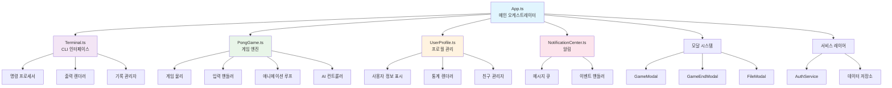
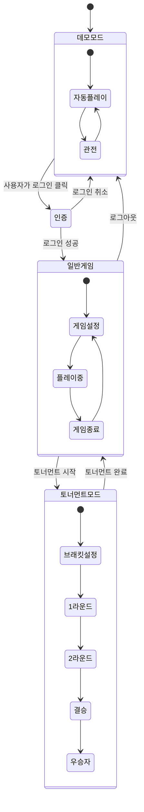
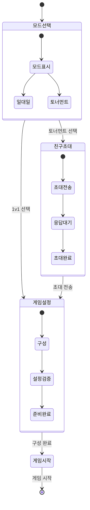
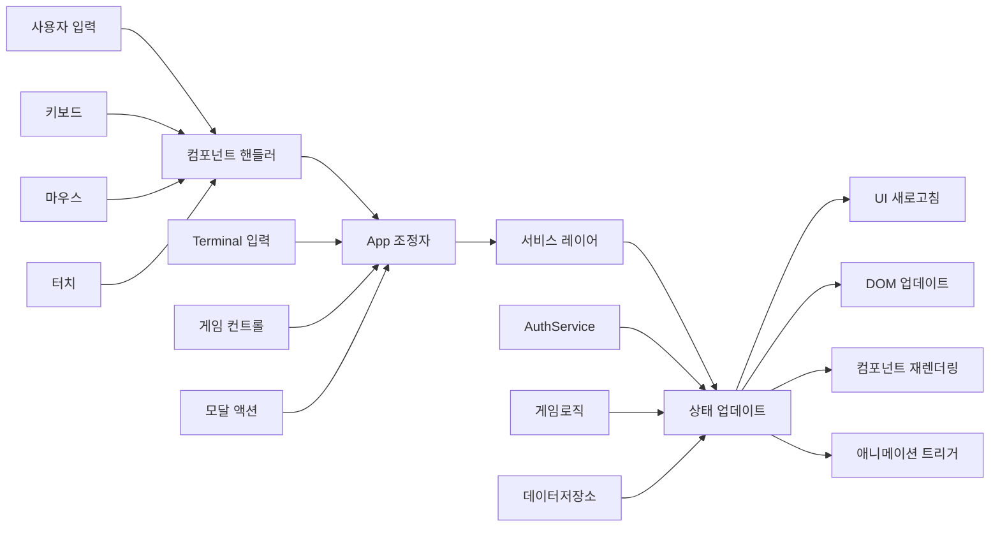
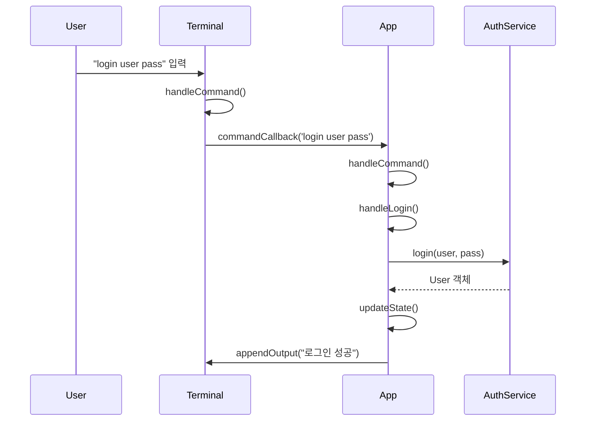
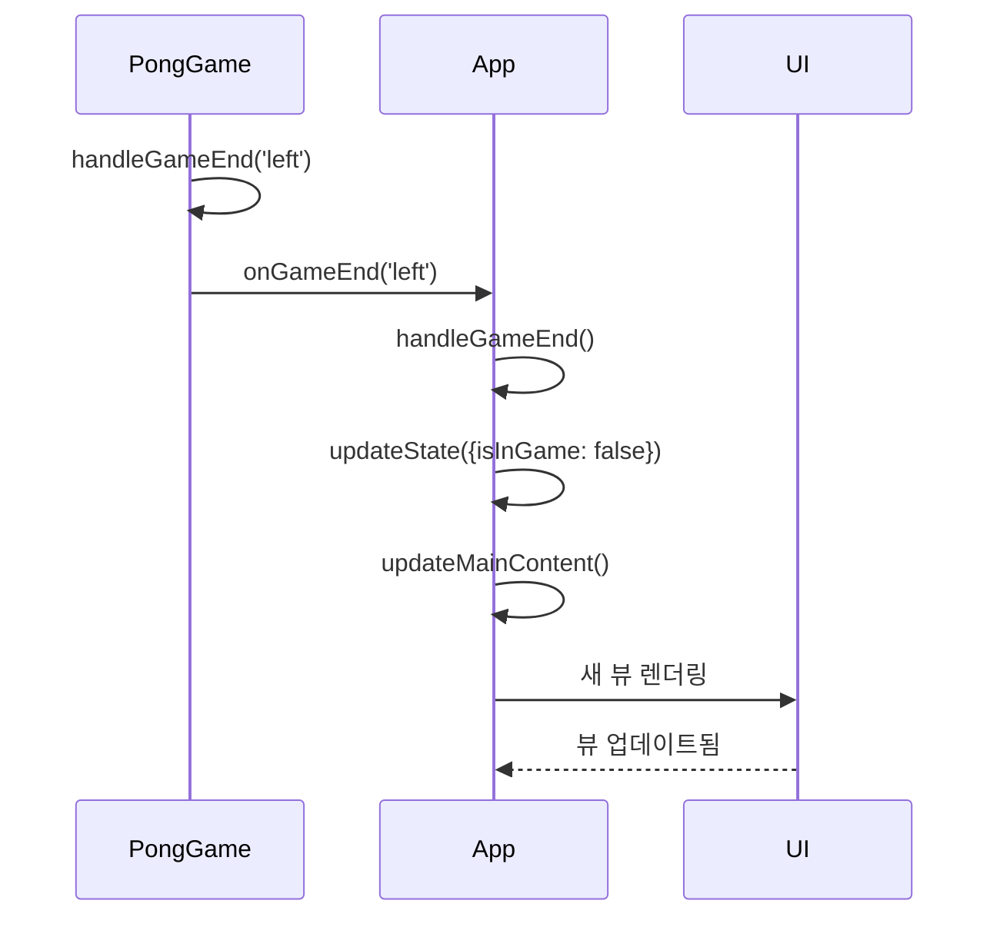
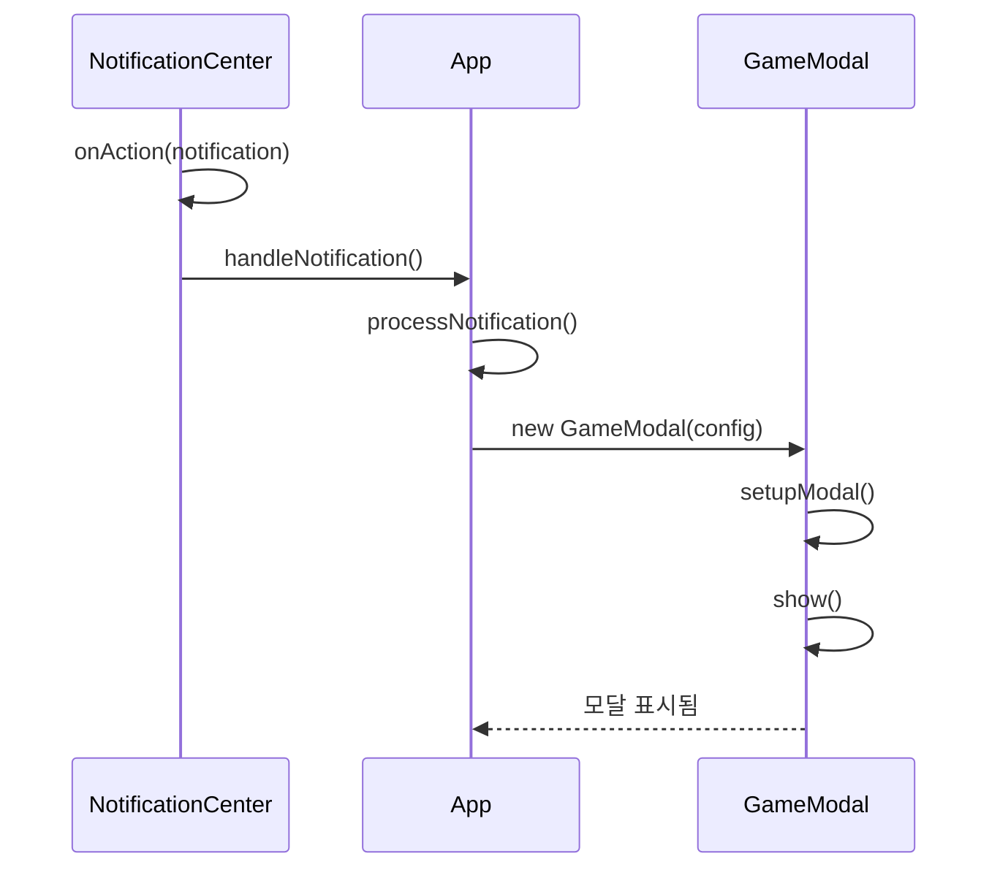

# PONG-CLI - 컴포넌트 아키텍처 문서

## 🏗️ 아키텍처 개요

PONG-CLI 애플리케이션은 명확한 관심사의 분리, 이벤트 기반 통신, 중앙화된 상태 관리를 갖춘 **컴포넌트 기반 아키텍처**를 따릅니다. 각 컴포넌트는 잘 정의된 인터페이스를 통해 통신하면서 자체 DOM 관리, 비즈니스 로직, 사용자 상호작용을 캡슐화합니다.

### 핵심 아키텍처 원칙

1. **단일 책임**: 각 컴포넌트는 하나의 주요 목적을 가집니다
2. **의존성 주입**: 컴포넌트는 생성자를 통해 의존성을 받습니다
3. **이벤트 기반 통신**: 컴포넌트는 콜백과 이벤트를 통해 통신합니다
4. **DOM 캡슐화**: 각 컴포넌트는 자체 DOM 요소를 관리합니다
5. **상태 격리**: 컴포넌트 상태는 제어된 접근으로 캡슐화됩니다

## 🎯 컴포넌트 계층 구조 및 관계

```
                              ┌─────────────────┐
                              │      App.ts     │
                              │   (오케스트레이터) │
                              └─────────┬───────┘
                                        │
           ┌────────────────────────────┼────────────────────────────┐
           │                            │                            │
    ┌──────▼──────┐            ┌────────▼────────┐         ┌────────▼────────┐
    │ Terminal.ts │            │  PongGame.ts    │         │ UserProfile.ts  │
    │   (CLI)     │            │    (게임)        │         │   (프로필)        │
    └─────────────┘            └─────────────────┘         └─────────────────┘
           │                            │                            │
    ┌──────▼──────┐            ┌────────▼────────┐         ┌────────▼────────┐
    │   명령       │            │   게임 상태       │         │  사용자 데이터      │
    │  프로세서     │            │   관리           │         │  렌더링           │
    └─────────────┘            └─────────────────┘         └─────────────────┘

                    ┌─────────────────────────────────────┐
                    │          모달 시스템                   │
                    ├─────────────────────────────────────┤
                    │ GameModal │ GameEndModal │FileModal │
                    └─────────────────────────────────────┘

                    ┌─────────────────────────────────────┐
                    │        서비스 레이어                   │
                    ├─────────────────────────────────────┤
                    │ AuthService │ NotificationCenter    │
                    └─────────────────────────────────────┘
```

### 컴포넌트 계층 구조 다이어그램



## 🧩 핵심 컴포넌트 심화 분석

### **App.ts - 메인 애플리케이션 오케스트레이터**

#### **아키텍처 역할**
애플리케이션 상태, 컴포넌트 생명주기, 컴포넌트 간 통신을 관리하는 중앙 조정자입니다.

#### **내부 구조**
```typescript
class App {
  // 핵심 상태 관리
  private state: AppState = {
    isLoggedIn: boolean,
    currentUser: User | null,
    isInGame: boolean
  }
  
  // 컴포넌트 인스턴스
  private pongGame: PongGame
  private userProfile: UserProfile | null
  private notificationCenter: NotificationCenter
  private authService: AuthService
  
  // UI 관리
  private tabs: Tab[]
  private activeTabId: string
  private mainContent: HTMLElement
}
```

#### **주요 책임**

1. **상태 관리**
   ```typescript
   // 중앙화된 애플리케이션 상태
   private updateState(newState: Partial<AppState>): void {
     this.state = { ...this.state, ...newState };
     this.updateMainContent();
   }
   
   // 상태 기반 UI 업데이트
   private updateMainContent(): void {
     if (this.state.isLoggedIn && this.state.isInGame) {
       this.renderGameView();
     } else if (this.state.isLoggedIn) {
       this.renderProfileView();
     } else {
       this.renderDemoView();
     }
   }
   ```

2. **컴포넌트 생명주기 관리**
   ```typescript
   // 의존성 주입을 통한 컴포넌트 초기화
   constructor() {
     this.pongGame = new PongGame(this.handleGameEnd.bind(this));
     this.notificationCenter = new NotificationCenter(this.handleNotification.bind(this));
     this.authService = new AuthService();
   }
   ```

3. **이벤트 조정**
   ```typescript
   // 명령 처리 및 위임
   private handleCommand(command: string): void {
     switch (command.split(' ')[0]) {
       case 'login': this.handleLogin(command); break;
       case 'play': this.handlePlay(command); break;
       case 'profile': this.handleProfile(command); break;
     }
   }
   ```

#### **상태 흐름 패턴**
- **인증 흐름**: 로그인 → 프로필 업데이트 → UI 새로고침
- **게임 흐름**: 게임 시작 → 상태 업데이트 → 컴포넌트 렌더링
- **네비게이션 흐름**: 명령 → 상태 변경 → 뷰 전환

---

### **PongGame.ts - 게임 엔진 컴포넌트**

#### **아키텍처 역할**
Pong 게임의 모든 게임 로직, 물리 계산, 렌더링을 캡슐화합니다.

#### **내부 구조**
```typescript
class PongGame {
  // 게임 상태
  private ballX: number, ballY: number
  private ballSpeedX: number, ballSpeedY: number
  private leftPaddleY: number, rightPaddleY: number
  private leftScore: number, rightScore: number
  
  // 게임 구성
  public gameMode: 'regular' | 'tournament' | 'demo'
  private isMultiplayer: boolean
  
  // DOM 요소
  private gameElement: HTMLElement
  private ball: HTMLElement
  private leftPaddle: HTMLElement, rightPaddle: HTMLElement
  
  // 애니메이션 관리
  private animationId: number
  private keyState: { [key: string]: boolean }
}
```

#### **주요 책임**

1. **물리 엔진**
   ```typescript
   private updateBallPosition(): boolean {
     // 공 움직임 계산
     this.ballX += this.ballSpeedX;
     this.ballY += this.ballSpeedY;
     
     // 경계 충돌 감지
     if (this.ballY <= 0 || this.ballY >= this.canvasHeight - this.ballSize) {
       this.ballSpeedY = -this.ballSpeedY;
     }
     
     // 패들 충돌 감지
     this.checkPaddleCollision();
     
     return this.checkScoringConditions();
   }
   ```

2. **게임 루프 관리**
   ```typescript
   private update(): void {
     if (!this.gameStarted) return;
     
     this.updatePlayerPaddle();
     this.updateAIPaddles();
     
     const scored = this.updateBallPosition();
     if (scored) {
       this.handleRoundEnd(winner);
     }
     
     this.updateDOMElements();
     this.animationId = requestAnimationFrame(() => this.update());
   }
   ```

3. **입력 처리**
   ```typescript
   private setupControls(): void {
     window.addEventListener('keydown', (e) => {
       this.keyState[e.key] = true;
     });
     
     window.addEventListener('keyup', (e) => {
       this.keyState[e.key] = false;
     });
   }
   ```

#### **게임 상태 전환**
```
데모 모드 → 인증 → 일반 게임 → 토너먼트 모드
    ↓        ↓        ↓           ↓
자동 플레이  플레이어 설정  1v1 게임플레이  다중 라운드
```



---

### **Terminal.ts - CLI 인터페이스 컴포넌트**

#### **아키텍처 역할**
명령 처리 및 출력 포맷팅과 함께 진정한 터미널 인터페이스 시뮬레이션을 제공합니다.

#### **내부 구조**
```typescript
class Terminal {
  // DOM 구조
  private terminalElement: HTMLElement
  private outputElement: HTMLElement
  private inputElement: HTMLInputElement
  
  // 상태 관리
  private commandHistory: string[]
  private historyIndex: number
  private outputContent: string
  
  // 구성
  private type: 'main' | 'chat'
  private commandCallback: (command: string) => void
}
```

#### **주요 책임**

1. **명령 처리**
   ```typescript
   private handleInputKeydown(event: KeyboardEvent): void {
     if (event.key === 'Enter') {
       const command = this.inputElement.value.trim();
       
       if (this.type === 'chat') {
         this.handleChatMessage(command);
       } else {
         this.appendOutput(`$ ${command}`);
         this.commandCallback(command);
       }
       
       this.commandHistory.push(command);
       this.inputElement.value = '';
     }
   }
   ```

2. **출력 포맷팅**
   ```typescript
   public appendOutput(text: string): void {
     const messageElement = document.createElement('div');
     
     if (this.type === 'chat') {
       this.formatChatMessage(messageElement, text);
     } else {
       this.formatTerminalOutput(messageElement, text);
     }
     
     this.outputElement.appendChild(messageElement);
     this.scrollToBottom();
   }
   ```

3. **기록 관리**
   ```typescript
   // 명령 기록을 통한 화살표 키 탐색
   private handleHistoryNavigation(direction: 'up' | 'down'): void {
     if (direction === 'up' && this.historyIndex > 0) {
       this.historyIndex--;
       this.inputElement.value = this.commandHistory[this.historyIndex];
     }
   }
   ```

---

### **UserProfile.ts - 프로필 관리 컴포넌트**

#### **아키텍처 역할**
사용자 프로필 표시, 통계 렌더링, 프로필 관리 기능을 처리합니다.

#### **내부 구조**
```typescript
class UserProfile {
  private user: User
  private profileElement: HTMLElement
  private isCurrentUser: boolean
  
  // 렌더링 섹션
  private renderUserInfo(): HTMLElement
  private renderGameStats(): HTMLElement
  private renderMatchHistory(): HTMLElement
  private renderAchievements(): HTMLElement
}
```

#### **주요 책임**

1. **데이터 렌더링**
   ```typescript
   public render(): HTMLElement {
     const sections = [
       this.renderUserInfo(),
       this.renderGameStats(),
       this.renderMatchHistory(),
       this.renderAchievements()
     ];
     
     sections.forEach(section => {
       this.profileElement.appendChild(section);
     });
     
     return this.profileElement;
   }
   ```

2. **통계 표시**
   ```typescript
   private renderGameStats(): HTMLElement {
     const winRate = Math.round((this.user.gamesWon / this.user.gamesPlayed) * 100 || 0);
     const statsItems = [
       { value: this.user.gamesPlayed.toString(), label: '게임' },
       { value: this.user.gamesWon.toString(), label: '승리' },
       { value: `${winRate}%`, label: '승률' }
     ];
     
     return this.createStatsGrid(statsItems);
   }
   ```

## 🔄 모달 컴포넌트 아키텍처

### **모달 시스템 패턴**
모든 모달은 일관된 아키텍처 패턴을 따릅니다:

```typescript
abstract class BaseModal {
  protected modalElement: HTMLElement
  protected contentElement: HTMLElement
  protected onConfirm: (...args: any[]) => void
  protected onCancel: () => void
  
  constructor(onConfirm: Function, onCancel: Function) {
    this.setupModal();
    this.render();
  }
  
  protected abstract render(): void
  public show(): void { /* 모달 표시 */ }
  public close(): void { /* 모달 닫기 */ }
}
```

### **GameModal.ts - 게임 설정 인터페이스**

#### **상태 관리**
```typescript
class GameModal {
  private selectedMode: string = ''
  private invitedFriends: Friend[] = []
  private inviteStatuses: Map<string, 'pending' | 'accepted' | 'declined'>
  private selectedOpponent: Friend | null = null
  
  // 다단계 흐름 관리
  private showModeSelection(): void
  private showFriendInvite(): void
  private showDualPlayerMatch(): void
  private showTournamentBracket(): void
}
```

#### **흐름 상태 머신**
```
모드 선택 → 친구 초대 → 게임 설정 → 게임 시작
    ↓        ↓         ↓         ↓
[1v1/토너먼트] [초대 전송] [구성]   [시작]
```



## 📊 상태 관리 패턴

### **중앙화된 상태 (App.ts)**
```typescript
interface AppState {
  isLoggedIn: boolean
  currentUser: User | null
  isInGame: boolean
}

// 상태 업데이트 패턴
private updateAppState(updates: Partial<AppState>): void {
  const previousState = { ...this.state };
  this.state = { ...this.state, ...updates };
  
  // 반응적 업데이트 트리거
  this.onStateChange(previousState, this.state);
}
```

### **컴포넌트 로컬 상태**
```typescript
// PongGame 내부 상태
private gameState = {
  ballPosition: { x: number, y: number },
  paddlePositions: { left: number, right: number },
  scores: { left: number, right: number },
  gamePhase: 'countdown' | 'playing' | 'paused' | 'ended'
}

// Terminal 내부 상태
private terminalState = {
  commandHistory: string[],
  historyIndex: number,
  outputBuffer: string[],
  mode: 'main' | 'chat'
}
```

### **서비스 레이어 상태 (AuthService)**
```typescript
class AuthService {
  private users: Record<string, User> = {}
  
  // 상태 지속성 및 관리
  public updateUser(username: string, updates: Partial<User>): User {
    this.users[username] = { ...this.users[username], ...updates };
    return this.users[username];
  }
}
```

## ⚡ 이벤트 처리 시스템

### **이벤트 흐름 아키텍처**
```
사용자 입력 → 컴포넌트 핸들러 → App 조정자 → 서비스 레이어 → 상태 업데이트 → UI 새로고침
```



### **콜백 기반 통신**
```typescript
// 부모에서 자식으로 (의존성 주입)
class App {
  constructor() {
    this.pongGame = new PongGame((winner) => {
      this.handleGameEnd(winner);
    });
    
    this.terminal = new Terminal((command) => {
      this.handleCommand(command);
    });
  }
}

// 자식에서 부모로 (이벤트 콜백)
class PongGame {
  constructor(private onGameEnd?: (winner: 'left' | 'right') => void) {}
  
  private handleGameComplete(winner: 'left' | 'right'): void {
    this.onGameEnd?.(winner);
  }
}
```

### **이벤트 전파 패턴**

#### **1. 명령 이벤트**
```typescript
// Terminal → App → AuthService
Terminal.handleCommand('login user pass') 
  → App.handleCommand() 
  → App.handleLogin() 
  → AuthService.login()
```



#### **2. 게임 이벤트**
```typescript
// PongGame → App → UI 업데이트
PongGame.handleGameEnd('left') 
  → App.handleGameEnd() 
  → App.updateState({ isInGame: false }) 
  → App.updateMainContent()
```



#### **3. 알림 이벤트**
```typescript
// NotificationCenter → App → 모달 생성
NotificationCenter.onAction(notification) 
  → App.handleNotification() 
  → new GameModal()
```



### **DOM 이벤트 관리**
```typescript
class Component {
  private eventListeners: Array<{
    element: HTMLElement,
    event: string,
    handler: EventListener
  }> = [];
  
  protected addEventListener(element: HTMLElement, event: string, handler: EventListener): void {
    element.addEventListener(event, handler);
    this.eventListeners.push({ element, event, handler });
  }
  
  public destroy(): void {
    // 모든 이벤트 리스너 정리
    this.eventListeners.forEach(({ element, event, handler }) => {
      element.removeEventListener(event, handler);
    });
  }
}
```

## 🔧 컴포넌트 생명주기 관리

### **표준 생명주기 패턴**
```typescript
class Component {
  constructor(dependencies: Dependencies) {
    this.initializeState();
    this.createDOMElements();
    this.setupEventListeners();
    this.bindCallbacks();
  }
  
  public render(): HTMLElement {
    this.updateDOM();
    this.applyStyles();
    return this.element;
  }
  
  public update(data: any): void {
    this.updateState(data);
    this.updateDOM();
  }
  
  public destroy(): void {
    this.cleanup();
    this.removeEventListeners();
    this.cancelAnimations();
  }
}
```

### **비동기 생명주기 관리**
```typescript
// 비동기 의존성을 가진 컴포넌트 초기화
class GameModal {
  constructor() {
    this.setupModal();
    this.initializeAsync();
  }
  
  private async initializeAsync(): void {
    await this.loadFriendsList();
    await this.setupInviteHandlers();
    this.render();
  }
}
```

## 🧪 컴포넌트 테스트 아키텍처

### **테스트 가능한 컴포넌트 구조**
```typescript
class TestableComponent {
  // 테스트를 위한 공개 인터페이스
  public getState(): ComponentState { return this.state; }
  public handleEvent(event: Event): void { /* 이벤트 처리 */ }
  public render(): HTMLElement { /* 컴포넌트 렌더링 */ }
  
  // 개인 구현 세부사항
  private state: ComponentState;
  private updateState(): void { /* 업데이트 로직 */ }
}
```

### **모킹 친화적 의존성**
```typescript
interface GameEngine {
  start(): void;
  stop(): void;
  getScore(): { left: number, right: number };
}

class PongGame implements GameEngine {
  constructor(private physics: PhysicsEngine = new RealPhysicsEngine()) {}
  
  // 테스트용: MockPhysicsEngine 주입
}
```

## 🚀 성능 최적화 패턴

### **효율적인 DOM 업데이트**
```typescript
class OptimizedComponent {
  private scheduledUpdate = false;
  
  private requestUpdate(): void {
    if (!this.scheduledUpdate) {
      this.scheduledUpdate = true;
      requestAnimationFrame(() => {
        this.updateDOM();
        this.scheduledUpdate = false;
      });
    }
  }
}
```

### **메모리 관리**
```typescript
class MemoryManagedComponent {
  private animations: number[] = [];
  private timers: number[] = [];
  
  public destroy(): void {
    // 모든 애니메이션 취소
    this.animations.forEach(id => cancelAnimationFrame(id));
    
    // 모든 타이머 정리
    this.timers.forEach(id => clearTimeout(id));
    
    // 이벤트 리스너 제거
    this.cleanup();
  }
}
```

---

이 컴포넌트 아키텍처는 유지보수 가능하고, 테스트 가능하며, 확장 가능한 코드를 위한 견고한 기반을 제공합니다. 명확한 관심사의 분리, 잘 정의된 인터페이스, 일관된 패턴은 애플리케이션을 이해하고, 확장하고, 디버깅하기 쉽게 만듭니다. 