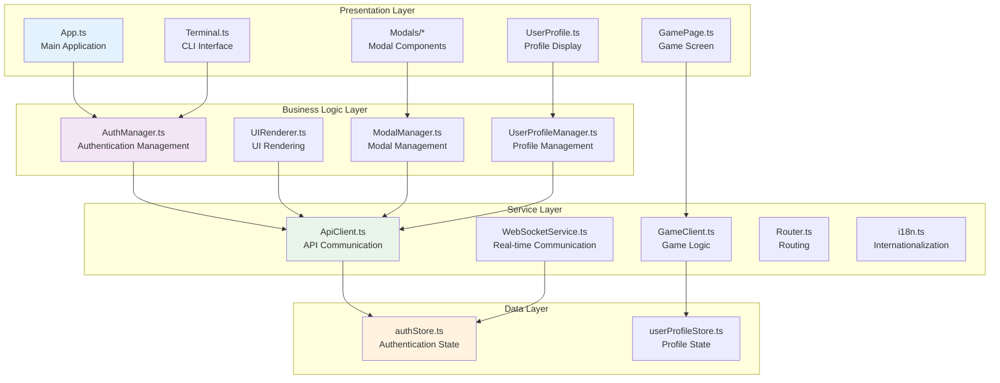
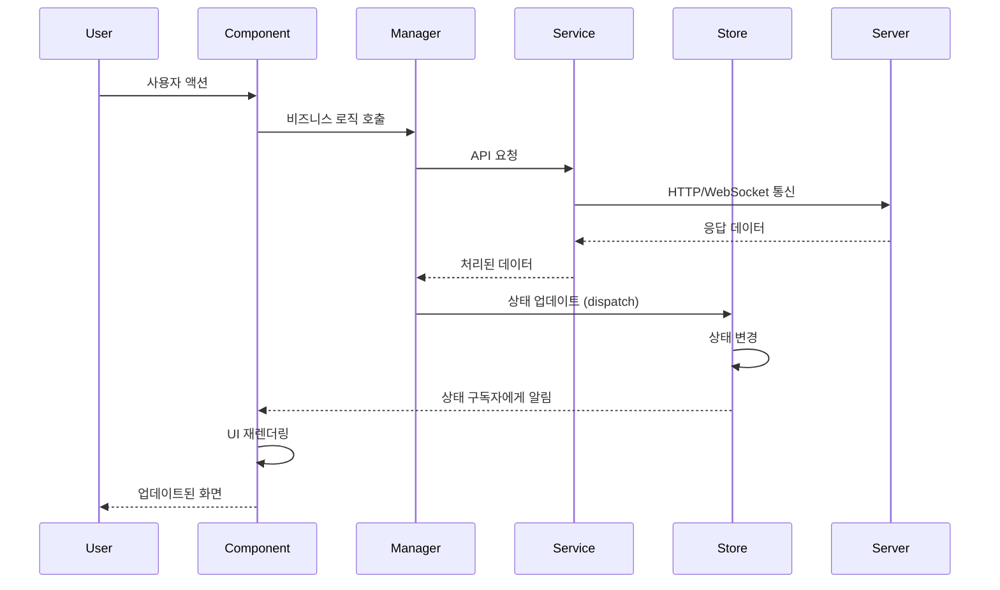

# ft_transcendence Frontend - Component Architecture Documentation

## 🏗️ Architecture Overview

The ft_transcendence frontend adopts a **layered component architecture** to provide a scalable and maintainable structure through clear separation of concerns, dependency injection, and state management. Each layer has its unique responsibilities and interacts through well-defined interfaces.

### Core Architecture Principles

1. **Layered Structure**: Presentation → Business Logic → Service → Data
2. **Dependency Injection**: Explicit dependency management through constructors
3. **State Centralization**: Store-based state management (Redux pattern)
4. **Event-driven Communication**: Observer pattern and callback system
5. **Modularization**: Independent module composition by functionality
6. **Type Safety**: Strong type system based on TypeScript

## 🎯 계층별 컴포넌트 구조

```
┌─────────────────────────────────────────────────────────────┐
│                    Presentation Layer                       │
├─────────────────────────────────────────────────────────────┤
│  App.ts  │  Terminal.ts  │  UserProfile.ts  │  Modals/     │
│          │               │                  │  GamePage.ts │
└─────────────────────────────────────────────────────────────┘
                              │
┌─────────────────────────────────────────────────────────────┐
│                   Business Logic Layer                     │
├─────────────────────────────────────────────────────────────┤
│ AuthManager │ UIRenderer │ ModalManager │ UserProfileMgr │
└─────────────────────────────────────────────────────────────┘
                              │
┌─────────────────────────────────────────────────────────────┐
│                     Service Layer                          │
├─────────────────────────────────────────────────────────────┤
│ ApiClient │ WebSocketService │ i18n │ GameClient │ Router │
└─────────────────────────────────────────────────────────────┘
                              │
┌─────────────────────────────────────────────────────────────┐
│                      Data Layer                            │
├─────────────────────────────────────────────────────────────┤
│        authStore        │      userProfileStore           │
└─────────────────────────────────────────────────────────────┘
```

### Layer-by-Layer Component Structure



## 🧩 Core Component Deep Dive

### **App.ts - Main Application Controller**

#### **Architecture Role**
Root controller responsible for managing the entire application lifecycle, routing, component coordination, and dependency injection.

#### **Internal Structure**
```typescript
class App {
  // Dependencies (constructor injection)
  private router: Router
  private authManager: AuthManager
  private uiRenderer: UIRenderer
  private modalManager: ModalManager
  private userProfileManager: UserProfileManager
  
  // Component instances
  private terminal: Terminal
  private userProfile: UserProfile | null
  private gamePage: GamePage | null
  
  // State subscriptions
  private subscriptions: Array<() => void> = []
  
  constructor() {
    this.initializeDependencies()
    this.setupComponents()
    this.subscribeToStores()
    this.setupRouting()
  }
}
```

#### **Key Responsibilities**

1. **Dependency Injection and Initialization**
   ```typescript
   private initializeDependencies(): void {
     const apiClient = new ApiClient()
     this.authManager = new AuthManager(apiClient)
     this.uiRenderer = new UIRenderer(this.authManager)
     this.modalManager = ModalManager.getInstance()
     this.userProfileManager = new UserProfileManager(apiClient)
   }
   ```

2. **Routing Management**
   ```typescript
   private setupRouting(): void {
     this.router.addRoute('/', () => this.renderTerminalView())
     this.router.addRoute('/game', () => this.renderGameView())
     this.router.addRoute('/profile', () => this.renderProfileView())
     this.router.addRoute('/tournament', () => this.renderTournamentView())
   }
   ```

3. **State Subscription and Response**
   ```typescript
   private subscribeToStores(): void {
     const authUnsub = authStore.subscribe('user', (user) => {
       this.handleUserChange(user)
     })
     
     const profileUnsub = userProfileStore.subscribe('profile', (profile) => {
       this.handleProfileChange(profile)
     })
     
     this.subscriptions.push(authUnsub, profileUnsub)
   }
   ```

---

### **Terminal.ts - CLI-style Terminal Interface**

#### **Architecture Role**
Primary interface with users, responsible for command input, output display, and command history management.

#### **Internal Structure**
```typescript
class Terminal {
  // DOM structure
  private terminalElement: HTMLElement
  private outputContainer: HTMLElement
  private inputElement: HTMLInputElement
  private promptElement: HTMLElement
  
  // State management
  private commandHistory: string[] = []
  private historyIndex: number = -1
  private currentPath: string = '~'
  
  // Dependencies
  private commandHandler: CommandHandler
  private i18n: typeof i18n
  
  constructor(commandHandler: CommandHandler) {
    this.commandHandler = commandHandler
    this.i18n = i18n
    this.initialize()
  }
}
```

#### **Key Responsibilities**

1. **Command Processing and Execution**
   ```typescript
   private async handleCommand(command: string): Promise<void> {
     this.addToHistory(command)
     this.appendOutput(`${this.getPrompt()} ${command}`)
     
     try {
       const result = await this.commandHandler.execute(command)
       this.appendOutput(result.message, result.type)
     } catch (error) {
       this.appendOutput(this.i18n.t('terminal.error', { error: error.message }), 'error')
     }
   }
   ```

2. **Output Formatting and Display**
   ```typescript
   public appendOutput(text: string, type: 'info' | 'success' | 'error' | 'warning' = 'info'): void {
     const outputLine = document.createElement('div')
     outputLine.className = `terminal-output terminal-${type}`
     
     // Multi-language message processing
     const localizedText = this.processI18nText(text)
     outputLine.innerHTML = this.formatOutput(localizedText)
     
     this.outputContainer.appendChild(outputLine)
     this.scrollToBottom()
   }
   ```

3. **Keyboard Events and History Management**
   ```typescript
   private setupKeyboardHandlers(): void {
     this.inputElement.addEventListener('keydown', (event) => {
       switch (event.key) {
         case 'Enter':
           this.handleEnterKey()
           break
         case 'ArrowUp':
           this.navigateHistory('up')
           break
         case 'ArrowDown':
           this.navigateHistory('down')
           break
         case 'Tab':
           event.preventDefault()
           this.handleAutoComplete()
           break
       }
     })
   }
   ```

---

### **GamePage.ts - Game Page Component**

#### **Architecture Role**
A dedicated game page component responsible for game screen rendering, game client management, and input processing.

#### **Internal Structure**
```typescript
class GamePage {
  // Game systems
  private gameClient: GameClient
  private gameRenderer: GameRenderer
  private inputHandler: InputHandler
  private tournamentClient?: TournamentClient
  
  // DOM elements
  private gameContainer: HTMLElement
  private canvas: HTMLCanvasElement
  private uiOverlay: HTMLElement
  
  // State
  private gameMode: 'local' | 'online' | 'tournament'
  private isConnected: boolean = false
  
  constructor(gameMode: 'local' | 'online' | 'tournament') {
    this.gameMode = gameMode
    this.initializeGame()
  }
}
```

#### **Key Responsibilities**

1. **Game System Initialization**
   ```typescript
   private initializeGame(): void {
     this.setupCanvas()
     this.gameRenderer = new GameRenderer(this.canvas)
     
     if (this.gameMode === 'online' || this.gameMode === 'tournament') {
       this.gameClient = new GameClient()
       this.setupWebSocketConnection()
     }
     
     if (this.gameMode === 'tournament') {
       this.tournamentClient = new TournamentClient()
       this.setupTournamentSystem()
     }
     
     this.inputHandler = new InputHandler(this.handleGameInput.bind(this))
   }
   ```

2. **Real-time Game State Synchronization**
   ```typescript
   private setupWebSocketConnection(): void {
     this.gameClient.on('gameState', (state: GameState) => {
       this.gameRenderer.render(state)
       this.updateUI(state)
     })
     
     this.gameClient.on('gameEnd', (result: GameResult) => {
       this.handleGameEnd(result)
     })
     
     this.gameClient.on('error', (error: string) => {
       this.showError(error)
     })
   }
   ```

3. **Input Processing and Transmission**
   ```typescript
   private handleGameInput(input: GameInput): void {
     if (this.gameMode === 'local') {
       // Process local game logic
       this.processLocalInput(input)
     } else {
       // Send input to server
       this.gameClient.sendInput(input)
     }
   }
   ```

## 🔄 Business Logic Layer (Managers)

### **AuthManager.ts - Authentication Manager**

#### **Architecture Role**
Centrally manages authentication logic, token management, and user session processing.

```typescript
class AuthManager {
  private apiClient: ApiClient
  private tokenManager: TokenManager
  
  constructor(apiClient: ApiClient) {
    this.apiClient = apiClient
    this.tokenManager = new TokenManager()
  }
  
  // Login flow
  async login(credentials: LoginCredentials): Promise<User> {
    const response = await this.apiClient.auth.login(credentials)
    
    if (response.success) {
      this.tokenManager.setTokens(response.data.tokens)
      authStore.dispatch({ type: 'LOGIN_SUCCESS', payload: response.data.user })
      return response.data.user
    }
    
    throw new Error(response.error)
  }
  
  // Google OAuth flow
  async loginWithGoogle(): Promise<User> {
    const authUrl = await this.apiClient.auth.getGoogleAuthUrl()
    // OAuth flow processing...
  }
  
  // 2FA processing
  async verify2FA(code: string): Promise<boolean> {
    const response = await this.apiClient.auth.verify2FA(code)
    
    if (response.success) {
      authStore.dispatch({ type: '2FA_VERIFIED' })
      return true
    }
    
    return false
  }
}
```

### **ModalManager.ts - Modal Management System (Singleton)**

#### **Architecture Role**
Centrally manages the lifecycle, priority, and data transfer of all modals.

```typescript
class ModalManager {
  private static instance: ModalManager
  private modalStack: Modal[] = []
  private overlay: HTMLElement
  
  static getInstance(): ModalManager {
    if (!ModalManager.instance) {
      ModalManager.instance = new ModalManager()
    }
    return ModalManager.instance
  }
  
  openModal<T extends Modal>(
    ModalClass: new (...args: any[]) => T,
    props: ModalProps,
    options: ModalOptions = {}
  ): Promise<any> {
    return new Promise((resolve, reject) => {
      const modal = new ModalClass({
        ...props,
        onConfirm: resolve,
        onCancel: reject
      })
      
      this.modalStack.push(modal)
      this.showOverlay()
      modal.show()
      
      // ESC key handling
      if (options.closeOnEscape !== false) {
        this.setupEscapeHandler(modal)
      }
    })
  }
  
  closeModal(modal: Modal): void {
    const index = this.modalStack.indexOf(modal)
    if (index > -1) {
      this.modalStack.splice(index, 1)
      modal.destroy()
      
      if (this.modalStack.length === 0) {
        this.hideOverlay()
      }
    }
  }
}
```

## 🌐 Service Layer Architecture

### **ApiClient.ts - API Client Factory**

#### **Unified API Service Management**
```typescript
class ApiClient {
  private tokenManager: TokenManager
  private interceptors: Interceptors
  
  // API service instances
  public auth: AuthApiService
  public user: UserApiService
  public friend: FriendApiService
  public game: GameApiService
  public tournament: TournamentApiService
  
  constructor() {
    this.tokenManager = new TokenManager()
    this.interceptors = new Interceptors(this.tokenManager)
    
    // Initialize all API services
    this.initializeServices()
  }
  
  private initializeServices(): void {
    const baseConfig = {
      tokenManager: this.tokenManager,
      interceptors: this.interceptors
    }
    
    this.auth = new AuthApiService(baseConfig)
    this.user = new UserApiService(baseConfig)
    this.friend = new FriendApiService(baseConfig)
    this.game = new GameApiService(baseConfig)
    this.tournament = new TournamentApiService(baseConfig)
  }
}
```

### **WebSocketService.ts - Real-time Communication Service**

#### **Event-based Real-time Communication**
```typescript
class WebSocketService {
  private ws: WebSocket | null = null
  private eventHandlers: Map<string, Set<Function>> = new Map()
  private reconnectAttempts: number = 0
  private maxReconnectAttempts: number = 5
  
  connect(url: string): Promise<void> {
    return new Promise((resolve, reject) => {
      this.ws = new WebSocket(url)
      
      this.ws.onopen = () => {
        this.reconnectAttempts = 0
        resolve()
      }
      
      this.ws.onmessage = (event) => {
        const message = JSON.parse(event.data)
        this.handleMessage(message)
      }
      
      this.ws.onclose = () => {
        this.handleDisconnection()
      }
      
      this.ws.onerror = (error) => {
        reject(error)
      }
    })
  }
  
  // Event listener registration
  on<T>(event: string, handler: (data: T) => void): () => void {
    if (!this.eventHandlers.has(event)) {
      this.eventHandlers.set(event, new Set())
    }
    
    this.eventHandlers.get(event)!.add(handler)
    
    // Return unsubscribe function
    return () => {
      this.eventHandlers.get(event)?.delete(handler)
    }
  }
  
  // Message transmission
  emit(event: string, data: any): void {
    if (this.ws?.readyState === WebSocket.OPEN) {
      this.ws.send(JSON.stringify({ event, data, timestamp: Date.now() }))
    }
  }
}
```

## 📊 State Management Architecture

### **Custom State Management System**

#### **Base Store Structure**
```typescript
abstract class BaseStore<T> {
  protected state: T
  private subscribers: Map<keyof T, Set<Function>> = new Map()
  private middleware: Middleware[] = []
  
  constructor(initialState: T) {
    this.state = initialState
  }
  
  // State subscription
  subscribe<K extends keyof T>(
    key: K,
    callback: (value: T[K]) => void
  ): () => void {
    if (!this.subscribers.has(key)) {
      this.subscribers.set(key, new Set())
    }
    
    this.subscribers.get(key)!.add(callback)
    
    // Execute callback immediately with current value
    callback(this.state[key])
    
    // Return unsubscribe function
    return () => {
      this.subscribers.get(key)?.delete(callback)
    }
  }
  
  // Action dispatch
  dispatch(action: Action): void {
    const prevState = { ...this.state }
    
    // Execute middleware
    const processedAction = this.middleware.reduce(
      (acc, middleware) => middleware(acc, this.state),
      action
    )
    
    // Update state
    this.state = this.reducer(this.state, processedAction)
    
    // Find changed keys and notify subscribers
    this.notifySubscribers(prevState, this.state)
  }
  
  protected abstract reducer(state: T, action: Action): T
}
```

#### **authStore.ts - Authentication State Management**
```typescript
interface AuthState {
  user: User | null
  isAuthenticated: boolean
  isLoading: boolean
  error: string | null
  token: string | null
  refreshToken: string | null
}

class AuthStore extends BaseStore<AuthState> {
  constructor() {
    super({
      user: null,
      isAuthenticated: false,
      isLoading: false,
      error: null,
      token: null,
      refreshToken: null
    })
  }
  
  protected reducer(state: AuthState, action: AuthAction): AuthState {
    switch (action.type) {
      case 'LOGIN_START':
        return { ...state, isLoading: true, error: null }
        
      case 'LOGIN_SUCCESS':
        return {
          ...state,
          user: action.payload.user,
          token: action.payload.token,
          refreshToken: action.payload.refreshToken,
          isAuthenticated: true,
          isLoading: false,
          error: null
        }
        
      case 'LOGIN_FAILURE':
        return {
          ...state,
          isLoading: false,
          error: action.payload.error,
          isAuthenticated: false
        }
        
      case 'LOGOUT':
        return {
          user: null,
          isAuthenticated: false,
          isLoading: false,
          error: null,
          token: null,
          refreshToken: null
        }
        
      default:
        return state
    }
  }
}

export const authStore = new AuthStore()
```

## ⚡ 이벤트 처리 및 통신 패턴

### **이벤트 흐름 아키텍처**



### **컴포넌트 간 통신 패턴**

#### **1. Props Down, Events Up 패턴**
```typescript
// 부모 컴포넌트
class App {
  constructor() {
    this.terminal = new Terminal({
      onCommand: this.handleCommand.bind(this),
      currentUser: this.getCurrentUser(),
      i18n: this.i18n
    })
  }
  
  private handleCommand(command: string): void {
    // 명령어 처리 로직
  }
}

// 자식 컴포넌트
class Terminal {
  constructor(private props: TerminalProps) {
    this.setupEventHandlers()
  }
  
  private executeCommand(command: string): void {
    this.props.onCommand(command) // 이벤트 발생
  }
}
```

#### **2. 상태 구독 패턴**
```typescript
class UserProfile {
  constructor() {
    // 인증 상태 구독
    authStore.subscribe('user', (user) => {
      this.updateProfile(user)
    })
    
    // 프로필 상태 구독  
    userProfileStore.subscribe('profile', (profile) => {
      this.renderProfile(profile)
    })
  }
}
```

#### **3. 이벤트 버스 패턴 (전역 이벤트)**
```typescript
class EventBus {
  private static instance: EventBus
  private events: Map<string, Set<Function>> = new Map()
  
  static getInstance(): EventBus {
    if (!EventBus.instance) {
      EventBus.instance = new EventBus()
    }
    return EventBus.instance
  }
  
  on(event: string, handler: Function): () => void {
    if (!this.events.has(event)) {
      this.events.set(event, new Set())
    }
    
    this.events.get(event)!.add(handler)
    
    return () => {
      this.events.get(event)?.delete(handler)
    }
  }
  
  emit(event: string, data?: any): void {
    this.events.get(event)?.forEach(handler => handler(data))
  }
}

// 사용 예시
const eventBus = EventBus.getInstance()

// 게임 종료 이벤트 구독
eventBus.on('game:end', (result) => {
  modalManager.openModal(GameEndModal, { result })
})

// 게임 종료 이벤트 발생
eventBus.emit('game:end', { winner: 'player1', score: [10, 8] })
```

## 🔧 컴포넌트 생명주기 관리

### **표준 생명주기 패턴**
```typescript
interface ComponentLifecycle {
  initialize(): void
  render(): HTMLElement
  update(data?: any): void
  destroy(): void
}

abstract class BaseComponent implements ComponentLifecycle {
  protected element: HTMLElement
  protected subscriptions: Array<() => void> = []
  protected eventListeners: Array<{
    element: HTMLElement
    event: string
    handler: EventListener
  }> = []
  
  constructor(protected props: ComponentProps) {
    this.initialize()
  }
  
  initialize(): void {
    this.createElement()
    this.setupEventListeners()
    this.subscribeToStores()
    this.render()
  }
  
  abstract render(): HTMLElement
  
  update(data?: any): void {
    // 기본 업데이트 로직
    this.render()
  }
  
  destroy(): void {
    // 상태 구독 해제
    this.subscriptions.forEach(unsubscribe => unsubscribe())
    
    // 이벤트 리스너 제거
    this.eventListeners.forEach(({ element, event, handler }) => {
      element.removeEventListener(event, handler)
    })
    
    // DOM 요소 제거
    this.element?.remove()
  }
  
  protected addEventListener(
    element: HTMLElement,
    event: string,
    handler: EventListener
  ): void {
    element.addEventListener(event, handler)
    this.eventListeners.push({ element, event, handler })
  }
  
  protected subscribeToStore<T>(
    store: BaseStore<T>,
    key: keyof T,
    callback: (value: T[keyof T]) => void
  ): void {
    const unsubscribe = store.subscribe(key, callback)
    this.subscriptions.push(unsubscribe)
  }
}
```

### **Asynchronous Component Initialization**
```typescript
class AsyncComponent extends BaseComponent {
  private isInitialized: boolean = false
  
  async initialize(): Promise<void> {
    try {
      await this.loadDependencies()
      await this.fetchInitialData()
      
      super.initialize()
      this.isInitialized = true
    } catch (error) {
      this.handleInitializationError(error)
    }
  }
  
  private async loadDependencies(): Promise<void> {
    // Lazy loading modules
    const { GameEngine } = await import('../game/GameEngine')
    const { TournamentSystem } = await import('../game/TournamentSystem')
    
    this.gameEngine = new GameEngine()
    this.tournamentSystem = new TournamentSystem()
  }
  
  private async fetchInitialData(): Promise<void> {
    const apiClient = new ApiClient()
    const initialData = await apiClient.user.getProfile()
    
    userProfileStore.dispatch({
      type: 'PROFILE_LOADED',
      payload: initialData
    })
  }
}
```

## 🧪 Component Testing Architecture

### **Testable Component Structure**
```typescript
// Interface separation for testing
interface AuthManagerInterface {
  login(credentials: LoginCredentials): Promise<User>
  logout(): Promise<void>
  getCurrentUser(): User | null
}

class AuthManager implements AuthManagerInterface {
  constructor(
    private apiClient: ApiClient,
    private tokenManager: TokenManager = new TokenManager()
  ) {}
  
  // Implementation...
}

// Mock for testing
class MockAuthManager implements AuthManagerInterface {
  private mockUser: User | null = null
  
  async login(credentials: LoginCredentials): Promise<User> {
    this.mockUser = { id: '1', username: credentials.username, email: 'test@test.com' }
    return this.mockUser
  }
  
  async logout(): Promise<void> {
    this.mockUser = null
  }
  
  getCurrentUser(): User | null {
    return this.mockUser
  }
}
```

### **Component Unit Testing**
```typescript
// Component testing example
describe('Terminal Component', () => {
  let terminal: Terminal
  let mockCommandHandler: jest.Mocked<CommandHandler>
  
  beforeEach(() => {
    mockCommandHandler = {
      execute: jest.fn().mockResolvedValue({ message: 'Success', type: 'success' })
    } as jest.Mocked<CommandHandler>
    
    terminal = new Terminal(mockCommandHandler)
    document.body.appendChild(terminal.render())
  })
  
  afterEach(() => {
    terminal.destroy()
  })
  
  test('should execute command when Enter is pressed', async () => {
    const input = terminal.getInputElement()
    input.value = 'login user pass'
    
    // Simulate Enter key event
    const enterEvent = new KeyboardEvent('keydown', { key: 'Enter' })
    input.dispatchEvent(enterEvent)
    
    await waitFor(() => {
      expect(mockCommandHandler.execute).toHaveBeenCalledWith('login user pass')
    })
  })
  
  test('should add command to history', () => {
    terminal.executeCommand('test command')
    
    expect(terminal.getCommandHistory()).toContain('test command')
  })
})
```

## 🚀 Performance Optimization Patterns

### **Rendering Optimization**
```typescript
class OptimizedComponent extends BaseComponent {
  private renderScheduled: boolean = false
  private lastRenderTime: number = 0
  private readonly RENDER_THROTTLE = 16 // ~60fps
  
  update(data?: any): void {
    if (!this.renderScheduled) {
      this.renderScheduled = true
      
      requestAnimationFrame(() => {
        const now = performance.now()
        
        if (now - this.lastRenderTime >= this.RENDER_THROTTLE) {
          this.render()
          this.lastRenderTime = now
        }
        
        this.renderScheduled = false
      })
    }
  }
  
  // Virtual DOM pattern (simple implementation)
  private virtualRender(newVNode: VNode): void {
    const patches = diff(this.currentVNode, newVNode)
    patch(this.element, patches)
    this.currentVNode = newVNode
  }
}
```

### **Memory Management**
```typescript
class MemoryEfficientComponent extends BaseComponent {
  private objectPool: ObjectPool<GameObject> = new ObjectPool(() => new GameObject())
  private rafIds: number[] = []
  private timeoutIds: number[] = []
  
  private animate(): void {
    const rafId = requestAnimationFrame(() => {
      this.updateAnimation()
      this.animate()
    })
    
    this.rafIds.push(rafId)
  }
  
  destroy(): void {
    // Animation cleanup
    this.rafIds.forEach(id => cancelAnimationFrame(id))
    
    // Timer cleanup  
    this.timeoutIds.forEach(id => clearTimeout(id))
    
    // Object pool cleanup
    this.objectPool.clear()
    
    super.destroy()
  }
}

// Object pool pattern
class ObjectPool<T> {
  private pool: T[] = []
  
  constructor(private factory: () => T) {}
  
  acquire(): T {
    return this.pool.pop() || this.factory()
  }
  
  release(obj: T): void {
    if (obj && this.pool.length < 100) { // Maximum pool size limit
      this.pool.push(obj)
    }
  }
  
  clear(): void {
    this.pool.length = 0
  }
}
```

### **Code Splitting and Lazy Loading**
```typescript
class LazyLoadingManager {
  private loadedModules: Map<string, any> = new Map()
  
  async loadModule(moduleName: string): Promise<any> {
    if (this.loadedModules.has(moduleName)) {
      return this.loadedModules.get(moduleName)
    }
    
    let module: any
    
    switch (moduleName) {
      case 'game':
        module = await import('../game/GameModule')
        break
      case 'tournament':
        module = await import('../tournament/TournamentModule')
        break
      case 'ai':
        module = await import('../ai/AIModule')
        break
      default:
        throw new Error(`Unknown module: ${moduleName}`)
    }
    
    this.loadedModules.set(moduleName, module)
    return module
  }
  
  preloadModules(moduleNames: string[]): Promise<any[]> {
    return Promise.all(moduleNames.map(name => this.loadModule(name)))
  }
}
```

---

This component architecture reflects the current structure of the ft_transcendence frontend, ensuring scalability, maintainability, and testability. Through clear layer separation and dependency injection, each component's role and responsibilities are clearly defined, applying modern web application development patterns to provide a solid foundation.