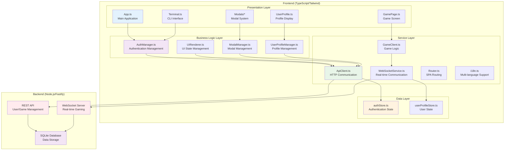
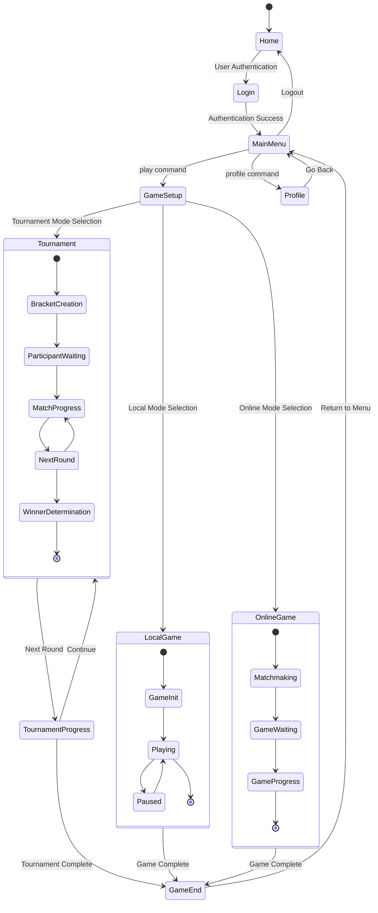
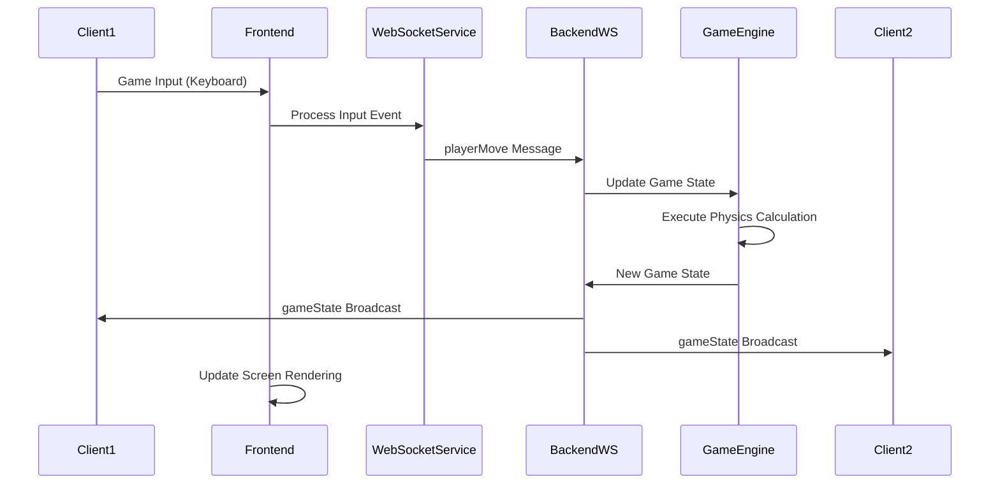
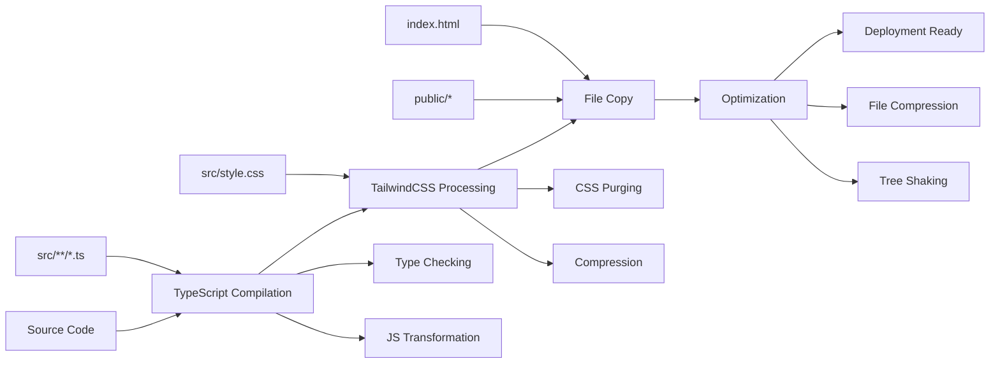

# ft_transcendence Frontend - Project Overview and Architecture

## 🎯 Project Overview

**ft_transcendence** is the final web project for 42Seoul, a modern web application that provides real-time multiplayer Pong games and tournament systems. It combines a terminal-style CLI interface with modern web technologies to deliver a unique and engaging user experience.

### Project Vision
- **Modern Web Technologies**: Adherence to latest web standards using TypeScript, Tailwind CSS, and WebSocket
- **Real-time Multiplayer**: Real-time gaming experience through server-based game logic and WebSocket
- **Comprehensive User Management**: Complete user system including authentication, 2FA, and social features
- **Scalable Architecture**: Modular design for easy maintenance and feature expansion
- **Multi-language Support**: Accessibility through support for 3 languages (Korean, English, Japanese)
- **Terminal Aesthetics**: Developer-friendly CLI-style interface

### Core Requirements (PRD-based)
- **WEB-TYPESCRIPT**: Pure implementation using only TypeScript and Tailwind CSS
- **WEB-SPA-NAV**: SPA navigation that respects browser history
- **WEB-ERROR-FREE**: Robust error handling with no errors during user interactions
- **WEB-BROWSER-COMPAT**: Guaranteed proper functionality across multiple browsers
- **WEB-MULTI-LANG**: Support for minimum 3 languages with language switching functionality

## 🛠️ Technology Stack

### Core Technologies
- **TypeScript**: Primary language for type safety and enhanced developer experience
- **Vanilla JavaScript**: Pure implementation without framework dependencies
- **TailwindCSS**: Utility-first CSS framework for rapid UI development
- **HTML5 Canvas**: High-performance game rendering and animation
- **WebSocket**: Real-time game communication and multiplayer support
- **i18next**: Internationalization library for multi-language support

### Development Tools
- **HTTP Server**: Development server for serving static files
- **PostCSS**: CSS preprocessing and optimization
- **TypeScript Compiler**: Code compilation and type checking
- **Docker**: Containerized deployment environment

### Key Features
- **Terminal CLI**: Command-based user interface
- **Authentication System**: Local login, Google OAuth, 2FA support
- **Social Features**: Friend system, real-time notifications, online status tracking
- **Game Modes**: Local, online, and tournament mode support
- **User Profile**: Statistics tracking, match history, achievement system
- **Real-time Communication**: WebSocket-based game state synchronization

## 🏗️ Application Architecture

### Layered Architecture Pattern
The ft_transcendence frontend adopts a **layered architecture** to ensure separation of concerns and scalability:

```
┌─────────────────────────────────────────────────────────────┐
│                    Presentation Layer                       │
│   App.ts │ Terminal.ts │ GamePage.ts │ UserProfile.ts      │
└─────────────────────────────────────────────────────────────┘
                              │
┌─────────────────────────────────────────────────────────────┐
│                   Business Logic Layer                     │
│ AuthManager │ UIRenderer │ ModalManager │ GameManager     │
└─────────────────────────────────────────────────────────────┘
                              │
┌─────────────────────────────────────────────────────────────┐
│                     Service Layer                          │
│ ApiClient │ WebSocketService │ i18n │ Router │ GameClient │
└─────────────────────────────────────────────────────────────┘
                              │
┌─────────────────────────────────────────────────────────────┐
│                      Data Layer                            │
│        authStore        │      userProfileStore           │
└─────────────────────────────────────────────────────────────┘
```

### Overall System Architecture



## 🧩 Core Component Details

### 1. **App Component** (`src/components/App.ts`)
**Role**: Central controller and lifecycle manager for the application
**Key Responsibilities**:
- Dependency injection and initialization (acts as DI container)
- SPA routing setup and navigation handling
- Global state subscription and UI state synchronization
- Component communication mediation
- Application lifecycle event handling

```typescript
// Core structure
class App {
  // Dependency injection
  private router: Router
  private authManager: AuthManager
  private uiRenderer: UIRenderer
  
  // State subscription management
  private subscriptions: Array<() => void> = []
  
  constructor() {
    this.initializeDependencies()
    this.setupRouting()
    this.subscribeToStores()
  }
}
```

### 2. **Terminal Component** (`src/components/Terminal.ts`)
**Role**: CLI-style user interface
**Key Responsibilities**:
- Command parsing and execution
- Terminal-style output rendering
- Command history and auto-completion
- Keyboard event handling
- Multi-language message display

### 3. **GamePage Component** (`src/game/GamePage.ts`)
**Role**: Game screen management and game system integration
**Key Responsibilities**:
- Canvas-based game rendering
- Real-time game state synchronization
- Input handling and server transmission
- Tournament system integration
- Game mode-specific UI management

### 4. **AuthManager** (`src/managers/AuthManager.ts`)
**Role**: Authentication and user session management
**Key Responsibilities**:
- Login/logout flow handling
- Google OAuth integration
- 2FA authentication management
- JWT token management
- User state synchronization

## 🎮 Game System Architecture

### Game State Flow


### Real-time Communication Architecture


## 🔄 State Management System

### Redux-like Pattern
ft_transcendence uses a custom state management system that provides a Redux-like pattern:

```typescript
// Store basic structure
abstract class BaseStore<T> {
  protected state: T
  private subscribers: Map<keyof T, Set<Function>>
  
  // State subscription
  subscribe<K extends keyof T>(key: K, callback: (value: T[K]) => void): () => void
  
  // Action dispatch
  dispatch(action: Action): void
  
  // Reducer (abstract method)
  protected abstract reducer(state: T, action: Action): T
}
```

### Main Stores

#### 1. **authStore** - Authentication State Management
```typescript
interface AuthState {
  user: User | null
  isAuthenticated: boolean
  isLoading: boolean
  error: string | null
  token: string | null
}

// Action types
type AuthAction = 
  | { type: 'LOGIN_START' }
  | { type: 'LOGIN_SUCCESS', payload: { user: User, token: string } }
  | { type: 'LOGIN_FAILURE', payload: { error: string } }
  | { type: 'LOGOUT' }
```

#### 2. **userProfileStore** - User Profile State
```typescript
interface UserProfileState {
  profile: UserProfile | null
  friends: Friend[]
  gameStats: GameStats
  matchHistory: Match[]
  isLoading: boolean
}
```

## 🌐 Service Layer Architecture

### API Communication System
```typescript
class ApiClient {
  // Specialized API services
  public auth: AuthApiService
  public user: UserApiService
  public friend: FriendApiService
  public game: GameApiService
  public tournament: TournamentApiService
  
  constructor() {
    this.initializeServices()
    this.setupInterceptors()
  }
}
```

### WebSocket Service
```typescript
class WebSocketService {
  private ws: WebSocket | null = null
  private eventHandlers: Map<string, Set<Function>>
  
  // Event-based communication
  on<T>(event: string, handler: (data: T) => void): () => void
  emit(event: string, data: any): void
  
  // Connection management
  connect(url: string): Promise<void>
  disconnect(): void
  reconnect(): void
}
```

## 🎨 UI/UX Design Philosophy

### Terminal Aesthetics
- **Color Palette**: 
  - Background: `#0a0a0a` (deep black)
  - Primary text: `#00ff00` (terminal green)
  - Accent: `#ffff00` (yellow)
  - Error: `#ff0000` (red)
  - Success: `#00ffff` (cyan)

- **Typography**: 
  - Primary: `JetBrains Mono, 'Courier New', monospace`
  - Size: Consistent monospace spacing
  - Style: Pixel-perfect rendering

- **Interaction Design**:
  - Keyboard-centric navigation
  - Command auto-completion
  - Fast keyboard shortcuts
  - Terminal-style animations

### Responsive Design Strategy
```css
/* Mobile-first approach */
.terminal-container {
  @apply w-full h-screen;
  
  /* Tablet */
  @apply md:max-w-4xl md:mx-auto md:my-8 md:h-auto;
  
  /* Desktop */
  @apply lg:max-w-6xl;
}

.game-canvas {
  @apply w-full h-64 md:h-96 lg:h-[500px];
}
```

## 🔧 Development Patterns and Best Practices

### Code Organization Principles
1. **Single Responsibility Principle**: Each class and function has only one responsibility
2. **Dependency Injection**: Explicit dependency management through constructors
3. **Interface Segregation**: Interface abstraction for testability
4. **Event-driven Architecture**: Event system for loose coupling

### Key Design Decisions
- **No Framework**: Pure TypeScript implementation for minimal bundle size
- **Type Safety**: Strong type system to prevent runtime errors
- **Component Encapsulation**: DOM and state encapsulation for each component
- **Service Layer Pattern**: Separation of business logic and presentation

### Performance Optimization Patterns
```typescript
// Rendering throttling
class OptimizedComponent {
  private renderScheduled = false
  
  update(): void {
    if (!this.renderScheduled) {
      this.renderScheduled = true
      requestAnimationFrame(() => {
        this.render()
        this.renderScheduled = false
      })
    }
  }
}

// Event delegation
class EventManager {
  setupGlobalHandlers(): void {
    document.addEventListener('click', this.handleGlobalClick.bind(this))
    document.addEventListener('keydown', this.handleGlobalKeydown.bind(this))
  }
}
```

## 🚀 Build and Deployment Pipeline

### Development Workflow
```bash
# Start development server
npm run dev

# Production build
npm run build

# Build preview
npm run preview

# Type checking
npm run typecheck
```

### Build Process


### Docker Containerization
```dockerfile
# Frontend Dockerfile
FROM node:18-alpine as builder
WORKDIR /app
COPY package*.json ./
RUN npm ci
COPY . .
RUN npm run build

FROM nginx:alpine
COPY --from=builder /app/dist /usr/share/nginx/html
COPY nginx.conf /etc/nginx/nginx.conf
EXPOSE 80
```

## 📈 Performance and Optimization

### Game Performance
- **60fps Target**: RequestAnimationFrame-based game loop
- **DOM Optimization**: Minimal DOM manipulation during gameplay
- **Memory Management**: Object pooling and garbage collection optimization
- **Network**: WebSocket message batching and compression

### Bundle Optimization
- **Code Splitting**: Module-based lazy loading
- **Tree Shaking**: Removal of unused code
- **Compression**: Gzip/Brotli compression utilization
- **Caching**: Aggressive browser caching strategy

## 🔮 Scalability and Future Plans

### Expandable Areas
1. **Game Modes**: Adding new game variations
2. **Social Features**: Chat, guild, ranking systems
3. **AI System**: More sophisticated AI opponents
4. **Mobile Support**: Touch-based interface
5. **Real-time Spectator**: Game spectating mode

### Architecture Benefits
- **Modular Design**: Independent feature development possible
- **Type Safety**: Safety guaranteed during refactoring
- **Testability**: Easy unit testing and integration testing
- **Performance Scalability**: Ability to optimize specific parts when needed

### Technical Debt Management
- **Regular Dependency Updates**: Security and performance improvements
- **Code Reviews**: Maintaining code quality
- **Performance Monitoring**: Real-time performance tracking
- **Documentation**: Continuous documentation updates

---

This architecture provides a solid foundation that meets the requirements of the ft_transcendence project while flexibly responding to future expansions and changes. Through clear layer separation and modular design, we have built a codebase that developers can easily understand and contribute to.