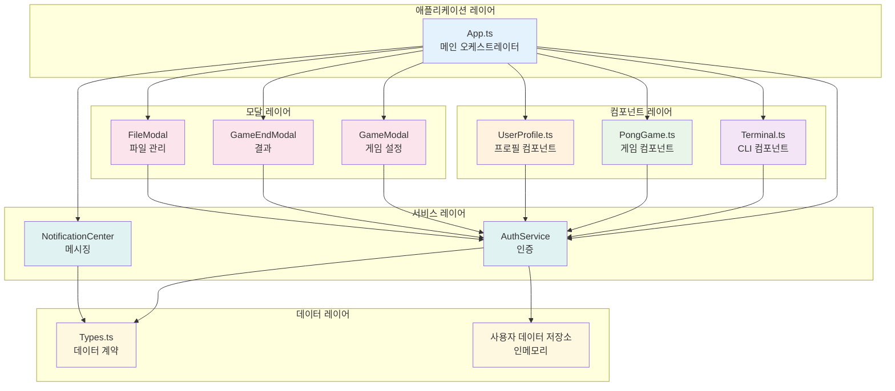
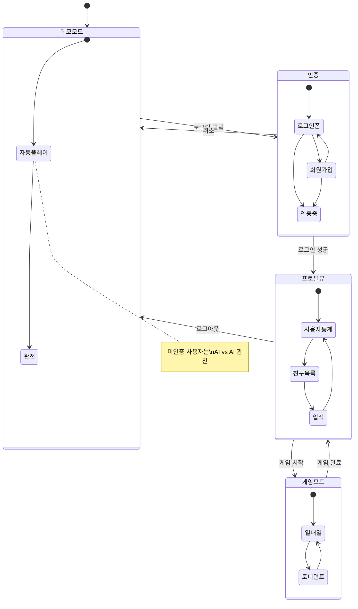
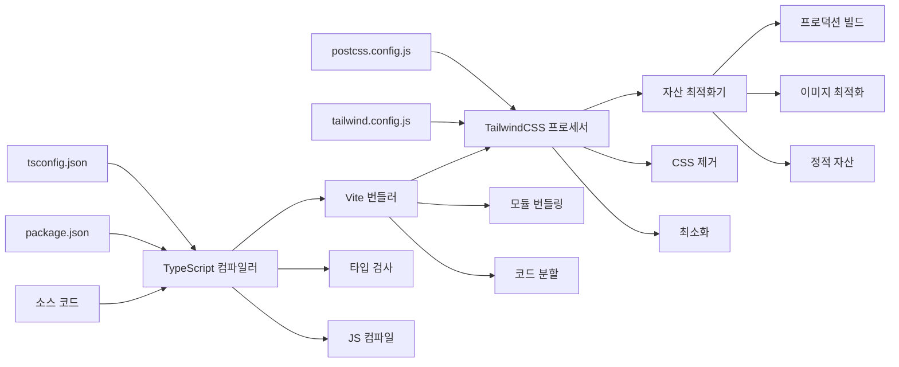

# PONG-CLI - 프로젝트 개요 및 아키텍처

## 🎯 프로젝트 개요

**PONG-CLI**는 명령줄 인터페이스를 모방한 현대적인 웹 애플리케이션으로 구축된 터미널 스타일의 Pong 게임 구현입니다. 이 프로젝트는 클래식 터미널 인터페이스의 향수를 불러일으키는 느낌과 현대적인 웹 기술을 결합하여 매력적인 게임 경험을 제공합니다.

### 프로젝트 비전
- 진정한 터미널 스타일의 게임 경험 창조
- 싱글플레이어 및 멀티플레이어 Pong 게임플레이 제공
- 소셜 기능을 갖춘 포괄적인 사용자 관리 시스템 구현
- 쉬운 유지보수와 확장을 위한 깨끗하고 모듈화된 아키텍처 유지

## 🛠️ 기술 스택

### 핵심 기술
- **TypeScript**: 타입 안전성과 더 나은 개발자 경험을 위한 주요 언어
- **Vite**: 빠른 HMR(Hot Module Replacement)을 위한 현대적인 빌드 도구 및 개발 서버
- **TailwindCSS**: 터미널 스타일 테마를 위한 유틸리티 우선 CSS 프레임워크
- **HTML5 Canvas**: 부드러운 게임 렌더링 및 애니메이션을 위함

### 주요 기능
- **터미널 UI**: 진정한 명령줄 인터페이스 시뮬레이션
- **인증 시스템**: 2FA 지원을 통한 사용자 등록, 로그인
- **소셜 기능**: 친구 시스템, 알림, 채팅 기능
- **게임 모드**: 데모, 일반 1v1, 토너먼트 모드
- **사용자 프로필**: 통계 추적, 업적, 경기 기록

## 🏗️ 애플리케이션 아키텍처

### 아키텍처 패턴
애플리케이션은 명확한 관심사의 분리를 갖춘 **컴포넌트 기반 아키텍처**를 따릅니다:

```
┌─────────────────────────────────────────────────────────────┐
│                        App.ts                               │
│                  (메인 오케스트레이터)                           │
├─────────────────────────────────────────────────────────────┤
│  ┌─────────────┐  ┌─────────────┐  ┌─────────────────────┐  │
│  │  Terminal   │  │  PongGame   │  │   UserProfile       │  │
│  │  컴포넌트     │  │  컴포넌트     │  │   컴포넌트             │  │
│  └─────────────┘  └─────────────┘  └─────────────────────┘  │
├─────────────────────────────────────────────────────────────┤
│  ┌─────────────┐  ┌─────────────┐  ┌─────────────────────┐  │
│  │   모달       │  │   알림       │  │   AuthService       │  │
│  │  (다양함)     │  │   센터       │  │   (데이터 레이어)      │  │
│  └─────────────┘  └─────────────┘  └─────────────────────┘  │
├─────────────────────────────────────────────────────────────┤
│                    타입 및 모델                                │
│                   (데이터 계약)                                │
└─────────────────────────────────────────────────────────────┘
```

### 아키텍처 개요 다이어그램



### 핵심 컴포넌트

#### 1. **App 컴포넌트** (`src/components/App.ts`)
- **역할**: 메인 애플리케이션 오케스트레이터 및 상태 관리자
- **책임**:
  - 애플리케이션 생명주기 관리
  - 다른 뷰(게임, 프로필, 터미널) 간의 라우트 처리
  - 사용자 인증 및 게임 상태에 대한 상태 관리
  - 터미널 세션 및 채팅을 위한 탭 관리
  - 명령 처리 및 위임

#### 2. **PongGame 컴포넌트** (`src/components/PongGame.ts`)
- **역할**: 게임 엔진 및 렌더링 시스템
- **책임**:
  - 게임 물리 및 공 움직임 계산
  - 패들 제어 (플레이어 입력 및 AI)
  - 충돌 감지 및 점수 계산
  - 게임 모드 (데모, 일반, 토너먼트)
  - 라운드 기반 게임플레이 관리

#### 3. **Terminal 컴포넌트** (`src/components/Terminal.ts`)
- **역할**: 명령줄 인터페이스 시뮬레이션
- **책임**:
  - 명령 입력 처리
  - 터미널 스타일 포맷팅으로 출력 렌더링
  - 명령 기록 관리
  - 채팅 모드 기능

#### 4. **UserProfile 컴포넌트** (`src/components/UserProfile.ts`)
- **역할**: 사용자 정보 표시 및 관리
- **책임**:
  - 프로필 정보 렌더링
  - 통계 표시 (플레이한 게임, 승리, 업적)
  - 친구 목록 관리
  - 사용자 설정 및 선호도

#### 5. **모달 컴포넌트**
- **GameModal**: 토너먼트 브래킷 및 게임 설정
- **GameEndModal**: 게임 후 결과 및 네비게이션
- **FileModal**: 프로필 관리를 위한 파일 시스템 시뮬레이션

### 데이터 레이어

#### AuthService (`src/utils/AuthService.ts`)
- **패턴**: 서비스 레이어 / 저장소 패턴
- **책임**:
  - 사용자 인증 (로그인, 등록)
  - 사용자 데이터 지속성 (인메모리 저장소)
  - 친구 관계 관리
  - 소셜 기능 (차단, 상태 추적)

#### 타입 시스템 (`src/models/Types.ts`)
- **패턴**: 인터페이스 분리
- **주요 인터페이스**:
  - `User`: 통계 및 관계를 포함한 완전한 사용자 프로필
  - `AppState`: 애플리케이션 전체 상태 관리
  - `Friend`: 친구 관계 및 상태 추적
  - `Notification`: 메시지 및 알림 시스템
  - `Achievement`: 게임화 시스템

## 🎮 게임 아키텍처

### 게임 흐름 상태
```
데모 모드 ←→ 인증 ←→ 프로필 뷰 ←→ 게임 모드
    ↓        ↓         ↓         ↓
자동 플레이  로그인/등록  사용자 통계  1v1/토너먼트
```



### 게임 모드
1. **데모 모드**: 미인증 사용자를 위한 자동 플레이 시연
2. **일반 모드**: 표준 1v1 Pong 게임플레이
3. **토너먼트 모드**: 여러 라운드를 가진 브래킷 스타일 경쟁

### 상태 관리
- **애플리케이션 상태**: App 컴포넌트에서 중앙화
- **게임 상태**: PongGame 컴포넌트 내에서 캡슐화
- **사용자 상태**: 반응적 업데이트를 통해 AuthService에서 관리

## 🎨 UI/UX 디자인 철학

### 터미널 미학
- **색상 스키마**: 클래식 검정 바탕에 녹색 터미널 색상
- **타이포그래피**: 진정한 모노스페이스 느낌을 위한 JetBrains Mono 폰트
- **상호작용**: 키보드 단축키를 가진 명령 기반 인터페이스
- **시각적 요소**: ASCII 스타일 테두리, 픽셀화된 게임 그래픽

### 반응형 디자인
- **레이아웃**: 데스크톱 경험에 최적화된 고정 너비 디자인
- **컴포넌트**: 일관된 간격을 가진 모듈식 UI 컴포넌트
- **애니메이션**: 터미널 느낌을 유지하면서 부드러운 전환

## 🔧 개발 패턴

### 코드 구성 원칙
1. **단일 책임**: 각 컴포넌트는 명확하고 집중된 목적을 가집니다
2. **의존성 주입**: 생성자를 통해 컴포넌트에 서비스가 주입됩니다
3. **이벤트 기반 아키텍처**: 컴포넌트는 콜백을 통해 통신합니다
4. **불변 상태 업데이트**: 제어된 메서드를 통한 상태 변경

### 주요 설계 결정
- **프레임워크 의존성 없음**: 순수 TypeScript/JavaScript 구현
- **컴포넌트 캡슐화**: 각 컴포넌트는 자체 DOM 요소를 관리
- **서비스 레이어**: 프레젠테이션 컴포넌트에서 분리된 비즈니스 로직
- **타입 안전성**: 애플리케이션 전체에 걸친 강력한 타이핑

## 🚀 빌드 및 배포

### 개발 워크플로
```bash
npm run dev      # HMR을 사용한 개발 서버 시작
npm run build    # TypeScript 컴파일을 통한 프로덕션 빌드
npm run preview  # 로컬에서 프로덕션 빌드 미리보기
```

### 빌드 파이프라인
1. **TypeScript 컴파일**: 소스 코드 타입 검사 및 컴파일
2. **Vite 번들링**: 모듈 번들링 및 최적화
3. **TailwindCSS 처리**: CSS 제거 및 최적화
4. **자산 최적화**: 이미지 및 정적 자산 처리



## 📈 성능 고려사항

### 게임 성능
- **RAF (RequestAnimationFrame)**: 부드러운 60fps 게임 루프
- **DOM 최적화**: 게임플레이 중 최소한의 DOM 조작
- **이벤트 위임**: 효율적인 키보드 이벤트 처리

### 메모리 관리
- **컴포넌트 정리**: 적절한 이벤트 리스너 제거
- **애니메이션 정리**: 컴포넌트 파괴 시 cancelAnimationFrame
- **상태 관리**: 사용자 데이터 저장소에서 제어된 메모리 사용

## 🔮 확장 지점

### 쉽게 확장 가능한 영역
1. **새로운 게임 모드**: 토너먼트 변형 또는 다른 게임 타입 추가
2. **인증 방법**: OAuth 제공자 또는 외부 인증 통합
3. **소셜 기능**: 더 많은 상호작용 타입으로 친구 시스템 확장
4. **터미널 명령**: 향상된 기능을 위한 새로운 CLI 명령 추가
5. **업적 시스템**: 더 복잡한 업적 추적으로 확장

### 아키텍처 이점
- **모듈식 설계**: 기존 컴포넌트에 영향을 주지 않고 새로운 컴포넌트를 쉽게 추가
- **서비스 레이어**: 데이터 지속성 레이어를 간단히 교체 가능
- **타입 안전성**: TypeScript로 리팩터링 및 기능 추가가 더 안전
- **이벤트 기반**: 새로운 기능이 기존 이벤트 시스템에 연결 가능

---

이 아키텍처는 새로운 요구사항에 성장하고 적응할 수 있는 유연성을 유지하면서 PONG-CLI 애플리케이션을 위한 견고한 기반을 제공합니다. 명확한 관심사의 분리와 모듈식 설계는 새로운 개발자가 코드베이스를 이해하고 기여하기 쉽게 만듭니다. 